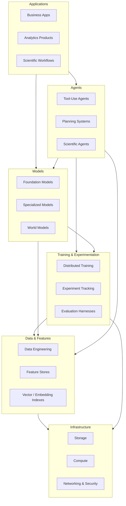
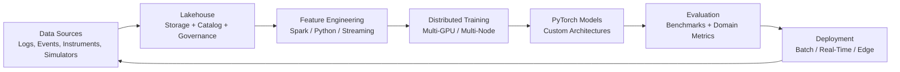
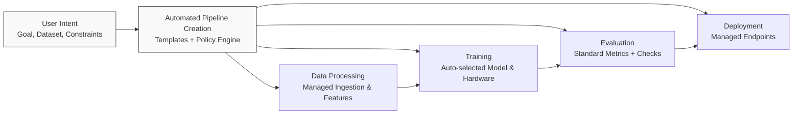
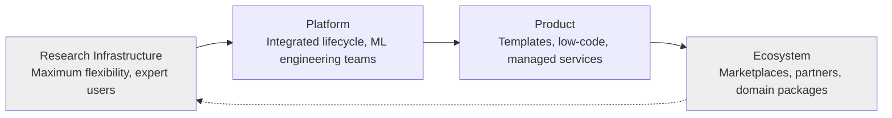
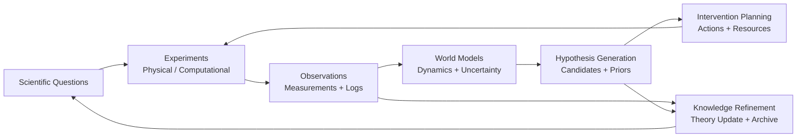
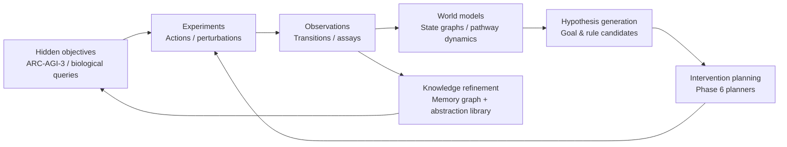

# From "Databricks Meets PyTorch" to "Databricks Meets Keras"

## The Evolution of AI Platforms from Research Infrastructure to Scientific Intelligence Systems

**Version:** 1.0  
**Date:** June 2026  
**Type:** Industry white paper

---

## Executive Summary

Modern artificial intelligence has outgrown the tooling that originally supported it. What began as a research discipline built on bespoke scripts, academic datasets, and single-GPU experiments has become an industrial process spanning petabyte-scale data lakes, trillion-parameter models, continuous deployment pipelines, and— increasingly— autonomous agents that reason, experiment, and act in complex environments. Yet the infrastructure supporting this transformation remains fragmented. Data engineering, model development, experimentation, deployment, monitoring, and scientific reasoning typically live in separate products, separate teams, and separate mental models.

This white paper analyzes two architectural patterns that capture successive stages in the evolution of AI platforms:

1. **"Databricks Meets PyTorch"** — enterprise-scale data and compute infrastructure combined with maximum model development flexibility. This pattern optimizes for research capability, custom architectures, distributed training at scale, and frontier experimentation.

2. **"Databricks Meets Keras"** — the same enterprise substrate combined with radical simplification of the developer and operator experience. This pattern optimizes for accessibility, faster time-to-value, reduced operational burden, and broad organizational adoption.

These labels are conceptual shorthand, not endorsements of specific vendors. They describe **design trade-offs** that recur across the industry: flexibility versus simplicity, research depth versus product velocity, expert control versus democratized access. Understanding this tension is essential for anyone building, investing in, or adopting AI infrastructure over the next decade.

The current state of AI infrastructure is characterized by **stack fragmentation**. Organizations routinely maintain separate systems for ingestion and storage (object stores, lakehouses), transformation (Spark, dbt), feature computation, experiment tracking, distributed training clusters, model registries, serving infrastructure, observability, and—when scientific or agentic workloads appear— ad hoc glue code connecting models to simulators, lab instruments, or interactive environments. Each layer solves a real problem; the composite system often does not.

The need for **unified platforms** is therefore not merely a consolidation play. It reflects a structural shift: AI workloads are becoming continuous, not episodic. Models are retrained on streaming data; agents operate in production loops; scientific workflows interleave hypothesis generation with live experimentation. Platforms that treat "training" and "inference" as isolated phases struggle when the dominant workload is **adaptive reasoning under uncertainty**.

Research-oriented systems ("Databricks Meets PyTorch") remain indispensable for frontier work— foundation models, reinforcement learning, world models, novel architectures, and scientific AI where problem structure is unknown. Accessibility-oriented systems ("Databricks Meets Keras") capture larger markets by lowering the expertise bar, compressing experimentation cycles, and embedding best practices into defaults. History suggests most transformative technologies traverse both stages: maximum capability first, then abstraction-driven adoption.

Looking forward, a third pattern is emerging: **Scientific Intelligence Platforms**, which integrate data, models, experiments, causal reasoning, simulation, and discovery into coherent workflows. The long-term trajectory may culminate in **Scientific Operating Systems**— persistent environments where autonomous agents maintain world representations, propose interventions, execute experiments, and refine mechanistic theories at scale.

**Main conclusions:**

- AI platform evolution is best understood as a sequence of abstraction layers, not a single "best" architecture.
- "Databricks Meets PyTorch" maximizes research and customization; "Databricks Meets Keras" maximizes adoption and operational efficiency.
- Simplicity often wins larger markets, but research flexibility remains the source of capability breakthroughs.
- The next competitive frontier is scientific intelligence: platforms that unify reasoning, experimentation, and knowledge accumulation.
- Strategic advantage will accrue to organizations and vendors that can span the full curve—from frontier flexibility to product simplicity to discovery-oriented integration— without sacrificing governance, reliability, or scientific validity.

**Applied illustration:** The Adaptive Scientific Reasoning Architecture (ASRA) project instantiates this full curve in a single research program— modular `asra-arc` library (PyTorch-class), versioned Kaggle agents (Keras-class), Phase 4–8 scientific reasoning loops (Scientific Intelligence Platform), and Phase 9 integration toward persistent cross-domain discovery. Section 8.3–8.9 develops this case study in detail.

---

## 1. Introduction

### 1.1 The evolution of AI tooling

Artificial intelligence tooling has evolved through distinct eras, each defined by what was scarce and what therefore required explicit engineering.

In the **classical machine learning era** (roughly 1990–2012), scarcity was **labeled data and statistical expertise**. Tooling centered on feature design, ensemble methods, and desktop-scale computation. Platforms were optional; Excel, R, and later scikit-learn sufficed for most organizational use cases.

The **deep learning era** (2012–2017) shifted scarcity to **GPU compute and neural architecture expertise**. Frameworks such as Caffe, Theano, TensorFlow, and PyTorch emerged as differentiable programming environments. Training moved from single machines to small clusters. The "platform" was still largely the framework itself plus a filesystem of scripts.

The **scale era** (2017–2022) made **data volume, distributed training, and reproducibility** the bottlenecks. Organizations adopted lakehouse architectures, workflow orchestrators, experiment trackers, and feature stores. MLOps crystallized as a discipline. AI ceased to be a research side project and became a production engineering concern.

The **foundation model era** (2022–present) introduced **pretraining economics**: capital-intensive, cluster-scale jobs producing general-purpose representations subsequently adapted through fine-tuning, retrieval, or prompting. Tooling bifurcated again— frontier labs needed maximum flexibility for novel architectures and training recipes, while enterprises needed fast adaptation paths with guardrails.

Each era added layers to the stack without removing prior ones. The result is today's **heterogeneous AI toolchain**: powerful at every layer, integrated at few.

### 1.2 The rise of data platforms

Before AI platforms matured, **data platforms** matured. The lakehouse pattern— unified storage for structured and unstructured data, ACID transactions on object storage, separation of compute and storage— solved a problem AI alone could not: trustworthy, governable access to organizational data at scale.

Data platforms introduced concepts AI systems now depend on:

- **Lineage and cataloging** — knowing what data exists, who owns it, and how it was transformed.
- **Incremental processing** — pipelines that scale with data growth without full rewrites.
- **Governance primitives** — access control, audit trails, and compliance hooks.
- **Multi-tenant compute** — shared infrastructure with workload isolation.

For AI, the lakehouse (and cognate architectures) became the **system of record** for training corpora, feature tables, evaluation datasets, and production logs. Without this substrate, even the best model code cannot be operationalized reliably.

### 1.3 The rise of deep learning frameworks

Deep learning frameworks are **differentiable runtime environments**. They provide:

- Automatic differentiation through computational graphs or eager execution.
- GPU/TPU kernel libraries and distributed communication primitives.
- Model composition APIs (layers, modules, optimizers).
- Ecosystems of pretrained components and research implementations.

PyTorch's dominance in frontier research reflects design choices favoring **Pythonic imperativity**, dynamic computation graphs (in early adoption), strong research community norms, and tight integration with the Python scientific stack. TensorFlow's early strength in static graphs and production deployment eventually yielded high-level APIs (Keras) that dramatically lowered the adoption barrier— a pattern this paper returns to repeatedly.

Frameworks are not platforms. They do not, by themselves, solve data governance, multi-user scheduling, cost allocation, production monitoring, or experiment reproducibility across teams. Hence the recurring industry question: **what happens when enterprise data infrastructure meets a research-first framework?**

### 1.4 Emergence of foundation models

Foundation models changed the economics and architecture of AI platforms in four ways:

1. **Training is a capital event** — pretraining runs resemble industrial projects more than iterative experiments.
2. **Adaptation replaces training** — fine-tuning, LoRA, distillation, and prompting become the dominant enterprise workflows.
3. **Evaluation becomes multidimensional** — capability, safety, robustness, and domain fit must be measured simultaneously.
4. **Inference dominates cost** — serving, caching, routing, and quantization matter as much as training throughput.

These shifts pressure platforms to support both **frontier flexibility** (custom architectures, RLHF, multimodal fusion) and **product simplicity** (managed endpoints, prompt templates, guardrailed pipelines).

### 1.5 The need for integrated AI platforms

Integrated AI platforms address a simple failure mode: **handoffs**. When data engineers, ML engineers, researchers, and operators use disjoint tools, errors accumulate at interfaces:

- Training data snapshots diverge from production features.
- Experiment configurations are not reproducible on clusters.
- Models deploy without lineage to training code or data versions.
- Monitoring detects drift without closing the loop to retraining.
- Scientific hypotheses live in documents disconnected from executable workflows.

Integration does not mean monoliths. It means **coherent contracts** across layers: shared identity, metadata, artifact registries, and workflow engines that span research and production.

### 1.6 Scope of this paper

This paper examines five intersecting domains:

| Domain | Platform concern |
|--------|------------------|
| Data engineering | Reliable, governable pipelines feeding AI workloads |
| Machine learning | Training, evaluation, and deployment of predictive models |
| Deep learning | Large-scale neural computation and custom architectures |
| MLOps | Reproducibility, CI/CD, monitoring, and lifecycle management |
| Scientific AI | Experiment design, causal reasoning, simulation, and discovery |

The conceptual patterns "Databricks Meets PyTorch" and "Databricks Meets Keras" anchor the analysis. The paper then extends the framework toward Scientific Intelligence Platforms and Scientific Operating Systems— stages where AI infrastructure begins to resemble **infrastructure for reasoning**, not merely for prediction.

---

## 2. Understanding the AI Technology Stack

### 2.1 A layered model

A useful platform architecture decomposes into layers with explicit responsibilities and interfaces. The following table summarizes a reference model applicable across research and enterprise contexts.

| Layer | Examples (illustrative) | Purpose |
|-------|-------------------------|---------|
| **Storage** | Object stores, lakehouse tables, vector databases, model artifact stores | Durable persistence for raw data, features, embeddings, checkpoints, and logs |
| **Compute** | CPU/GPU/TPU clusters, serverless runners, specialized accelerators | Execute training, inference, simulation, and data processing at required scale |
| **Data engineering** | Spark, Flink, dbt, ingestion frameworks | Ingest, clean, join, and version datasets; enforce schema and quality |
| **Feature engineering** | Feature stores, transformation pipelines, embedding pipelines | Produce model-ready representations with consistency between train and serve |
| **Training** | Distributed trainers, hyperparameter systems, RL loops | Fit parameters to data under compute and time constraints |
| **Experimentation** | Experiment trackers, notebooks, workflow orchestrators | Compare runs, manage reproducibility, coordinate research workflows |
| **Deployment** | Model servers, batch scoring, edge runtimes, API gateways | Expose model capabilities to applications with latency and reliability SLAs |
| **Monitoring** | Drift detection, performance dashboards, alerting, audit logs | Observe behavior in production; trigger remediation |
| **Agents** | Tool-use frameworks, memory systems, planning modules | Autonomous or semi-autonomous systems that act over multiple steps |
| **Scientific reasoning** | Causal engines, simulators, hypothesis managers, lab integrations | Support discovery workflows: propose, test, refine mechanistic knowledge |

Layers are not strictly linear. Agents may invoke training jobs; monitoring may feed experimentation; scientific reasoning may generate new data engineering requirements. Platform design must therefore support **bidirectional data flow** and **shared metadata**, not just pipelines.

### 2.2 Diagram 1 — AI Technology Stack



**Reading the diagram:** Infrastructure and data layers anchor trust and scale. Training and experimentation convert data into parameterized behavior. Models encapsulate that behavior for inference. Agents orchestrate models, tools, and memory over extended tasks. Applications consume outcomes— predictions, decisions, discoveries, or automated actions.

Platform fragmentation typically appears as **missing arrows**: agents without governed data access, training without production feature parity, or deployment without monitoring feedback.

---

## 3. Databricks Meets PyTorch

### 3.1 Definition

**"Databricks Meets PyTorch"** denotes an architectural pattern where enterprise-scale data and compute infrastructure is tightly coupled to a **maximum-flexibility** model development environment.

Formally:

> *Enterprise-scale AI infrastructure combined with maximum model development flexibility.*

"Databricks" here represents the **lakehouse-class data platform**: governed storage, large-scale ETL/ELT, multi-tenant Spark (or equivalent) compute, cataloging, and organizational data boundaries. "PyTorch" represents the **research-first framework layer**: dynamic model construction, custom autograd, distributed training primitives, and an ecosystem optimized for novel architectures.

The pattern optimizes for teams that treat AI as **R&D-intensive engineering**— foundation model groups, robotics labs, quantitative research, computational science, and advanced ML product teams building proprietary models rather than consuming APIs exclusively.

### 3.2 Architectural characteristics

**Distributed training at scale.** The pattern assumes training jobs span many accelerators with data-parallel, tensor-parallel, pipeline-parallel, or hybrid strategies. Infrastructure must schedule gang allocations, handle stragglers, checkpoint frequently, and recover from node failures without losing days of compute.

**Custom architectures.** Research workflows require arbitrary computation graphs: new attention variants, mixture-of-experts routing, diffusion sampling loops, RL actor-critic stacks, or hybrid symbolic-neural systems. Platforms in this pattern expose low-level control— custom layers, manual optimization loops, hooks into C++/CUDA extensions— rather than constraining users to template architectures.

**Research workflows.** Notebooks, ad hoc scripts, and git-based code coexist with orchestrated jobs. Experiment tracking captures hyperparameters, git SHAs, data snapshots, and metrics, but does not replace the researcher's freedom to restructure code daily. Reproducibility is **aspirational and earned**, not enforced by rigid schemas.

**Foundation models.** Pretraining and large-scale fine-tuning require terabyte-to-petabyte IO, efficient dataloader pipelines, and integration with checkpoint storage. The PyTorch-side ecosystem (FSDP, DeepSpeed, Megatron-LM patterns) becomes part of the platform story even when not bundled by a single vendor.

**Reinforcement learning and interactive learning.** RL breaks the batch assumption: environments step, rewards arrive asynchronously, and policies update online. Infrastructure must support long-running simulators, human-in-the-loop feedback, and variable-length episodes— workloads poorly served by classic batch ETL mindsets.

**World models and simulation coupling.** Frontier AI increasingly trains models that predict environment dynamics, not static labels. The platform pattern extends toward **tight integration with simulators, game engines, or digital twins**— generating training data on demand rather than solely from historical logs.

**Scientific AI.** Computational science workloads— PDE surrogates, molecular dynamics, climate emulators— share needs with frontier ML: custom operators, HPC scheduling, mixed precision, and validation against domain-specific benchmarks. The PyTorch pattern maps naturally because scientific code is itself research code.

**Experimental architectures.** When problem structure is unknown, the winning move is to **defer standardization**. Platforms aligned with this pattern accept higher entropy: multiple framework versions, custom containers, and team-specific clusters.

### 3.3 Why PyTorch became dominant in frontier research

Several reinforcing factors explain PyTorch's research centrality (without implying it is universally optimal):

1. **Imperative programming model** — researchers think in terms of control flow; imperative APIs map cleanly to paper algorithms.
2. **Debuggability** — eager execution enables standard Python debugging during model development.
3. **Paper-to-code latency** — arXiv implementations appear in PyTorch first, creating a network effect.
4. **Extensibility** — custom autograd functions and CUDA extensions integrate without rewriting the entire stack.
5. **Interoperability** — ONNX, TorchScript, and serving runtimes address production, but the **authoring experience** remains research-native.

Enterprise platforms that "meet PyTorch" successfully do not merely install packages on VMs. They provide **data proximity** (training reads from lakehouse tables without brittle export steps), **identity and secrets** (access to private datasets and model artifacts), **cluster elasticity**, and **governed lineage** linking experiments to data versions— while preserving PyTorch's freedom at the code layer.

Additional factors include **JIT compilation and deployment paths** (TorchScript, ONNX export, TensorRT) that address the historical critique that research frameworks ignore production— without forcing research code into static graphs prematurely. **Community scale** matters: when a new paper drops, the reference implementation is likely PyTorch; reproducing baselines within days rather than weeks changes what questions teams can afford to ask.

Finally, **hardware vendor alignment**— NVIDIA's CUDA ecosystem, optimized kernels, and library integrations (cuDNN, NCCL)— reduced friction for GPU-scale research. Platforms piggyback on this alignment when they expose bare-metal or VM GPUs with minimal middleware rather than opaque proprietary runtimes.

### 3.4 Distributed training as a platform primitive

Distributed training is not merely "more GPUs." It changes how organizations structure teams, budgets, and software. At small scale, a researcher runs `python train.py` on a workstation. At enterprise scale, training becomes a **scheduled, multi-tenant workload** with constraints:

- **Gang scheduling** — all workers must start together or the job deadlocks.
- **Checkpoint cadence** — failure recovery trades storage IO against recomputation.
- **Data staging** — reading billions of tokens from remote storage without saturating networks requires prefetch pipelines, local NVMe caches, and columnar formats.
- **Gradient synchronization** — all-reduce patterns dominate inter-node bandwidth; topology-aware placement matters.

Platforms in the "Databricks Meets PyTorch" pattern treat these as **first-class services**, not DevOps tickets. A researcher writes PyTorch; the platform injects process groups, rendezvous endpoints, and fault-tolerant checkpoint paths. Without this injection, only the largest organizations can sustain frontier training— a market concentration dynamic regulators and open-source communities increasingly scrutinize.

### 3.5 Custom architectures and the long tail of innovation

Most deployed models use well-known building blocks— transformers, convnets, MLPs. Frontier advantage often comes from **architectural deltas**: sparse attention, state-space layers, retrieval augmentation inside the forward pass, or hybrid neuro-symbolic modules. These deltas rarely ship in vendor AutoML catalogs on day one.

The PyTorch pattern preserves a **long tail of innovation** at the cost of support burden. Platform teams must tolerate heterogeneous containers, nightly builds, and non-standard dependencies— while still enforcing security scanning and egress policies. The alternative— restricting researchers to approved templates— accelerates short-term compliance but slows breakthrough adoption.

### 3.6 Reinforcement learning and non-stationary workloads

Reinforcement learning workloads violate assumptions baked into classical data platforms:

| Assumption (batch ML) | RL reality |
|-----------------------|------------|
| Dataset fixed before training | Data generated online by environment interaction |
| IID samples | Sequential correlation; non-stationary policies |
| Single objective metric | Reward shaping, constraint satisfaction, multi-objective trade-offs |
| Training terminates | Policies may train indefinitely with periodic evaluation |

Platforms meeting PyTorch for RL must integrate **environment workers** (simulators, APIs, human feedback UIs) with **learner clusters** (GPU-heavy policy updates). Orchestration resembles distributed systems more than ETL. This is one reason RL-heavy organizations often build custom platforms atop generic Kubernetes rather than pure managed AutoML— the PyTorch pattern persists because the workload is not yet productizable.

### 3.7 World models and simulation-adjacent training

World models learn compressed dynamics: given state and action, predict next state or reward. They enable planning, counterfactual reasoning, and sample-efficient control. Training them requires **trajectory stores**— sequences of observations, actions, and outcomes— often terabytes of video or sensor data.

Simulation-adjacent platforms blur the line between data engineering and environment engineering:

- Procedural generators create infinite labeled variants (Procgen-style).
- Digital twins feed hybrid online/offline training.
- Physics engines provide differentiable or black-box transitions.

The PyTorch pattern wins here because integration code is research code— glue between simulators and learners changes weekly. Product platforms eventually package popular simulators; until then, flexibility dominates.

### 3.8 Scientific AI and HPC convergence

Computational science historically ran on **HPC schedulers** (Slurm, PBS) with Fortran, C++, or Python scripts. Deep learning brought GPU clusters with different job semantics. Scientific AI merges the two: PDE surrogates trained on simulation outputs; inverse problems with neural priors; uncertainty quantification combining Bayesian methods and deep ensembles.

"Databricks Meets PyTorch" for science means **unified metadata** across simulation campaigns and ML experiments— the same catalog knows which mesh resolution produced which training shard. Without unification, scientific ML reproduces the fragmentation batch ML suffered a decade ago.

### 3.9 Table — Traditional Enterprise ML vs Databricks Meets PyTorch

| Dimension | Traditional Enterprise ML | Databricks Meets PyTorch |
|-----------|---------------------------|---------------------------|
| **Flexibility** | Constrained to approved algorithms and batch features | Full programmatic control; arbitrary architectures and training loops |
| **Customization** | Template pipelines, AutoML, standardized feature sets | Custom layers, losses, simulators, and multi-stage training recipes |
| **Research capability** | Incremental model improvements on tabular or NLP baselines | Frontier experimentation: foundation models, RL, multimodal, world models |
| **Deployment** | Mature batch scoring and API patterns | Deployment often secondary; research throughput primary; serving may be bespoke |
| **Cost** | Predictable per-model costs; smaller compute footprints | High capex/opex for clusters; cost volatility from large experiments |
| **Scalability** | Scales horizontally for inference and batch prediction | Scales horizontally for training; IO and checkpointing dominate at largest scales |

Traditional enterprise ML optimizes **decision automation** on well-defined problems. The PyTorch pattern optimizes **capability creation** when problem definitions themselves evolve.

### 3.10 Diagram 2 — Databricks Meets PyTorch Architecture



The feedback loop from deployment to data sources closes the **continuous learning** cycle— when platforms support it. Many organizations implement the forward path (data → model → deploy) years before robust feedback (monitoring → retrain → validate → promote).

---

## 4. Databricks Meets Keras

### 4.1 Definition

**"Databricks Meets Keras"** denotes the architectural pattern where the same enterprise data and compute substrate is paired with **radical simplification** of the user experience for building and operating AI systems.

Formally:

> *Enterprise-scale AI infrastructure combined with radical simplicity.*

"Keras" here symbolizes the **high-level API layer**: sensible defaults, composable modules, minimal boilerplate, and progressive disclosure of complexity. Historically, Keras lowered deep learning's skill floor by wrapping TensorFlow (and later JAX, PyTorch backends) with ergonomic abstractions— `model.fit()`, standard layers, and built-in training loops.

The modern analogue is not a single library. It encompasses **managed AutoML**, **LLM adaptation wizards**, **visual pipeline builders**, **prompt-first application frameworks**, and **opinionated MLOps templates** that hide cluster configuration, container builds, and serving infrastructure behind declarative interfaces.

### 4.2 Architectural characteristics

**Abstraction layers.** Users express *intent* ("classify support tickets," "summarize documents," "forecast demand") rather than implementation ("three-layer transformer with cosine schedule and DDP"). The platform selects model families, hardware tiers, and pipeline topology— subject to policy constraints.

**Low-code and no-code AI.** Visual designers and form-based configurators enable domain experts to participate in model creation. Code remains available for escape hatches, but the **happy path** avoids repositories and CI/CD until necessary.

**Democratization.** AI capability spreads beyond specialized ML engineers to analysts, product managers, and operational teams— mirroring how spreadsheets democratized quantitative analysis decades ago.

**Faster experimentation.** Time from dataset registration to first deployed baseline shrinks from weeks to hours. Prebuilt evaluation suites, automatic hyperparameter search, and template serving endpoints accelerate iteration— at the cost of visibility into internals.

**Reduced operational complexity.** Infrastructure provisioning, scaling, patching, and monitoring integrate into managed services. Users consume **outcomes** (predictions, embeddings, agent responses) rather than operating Kubernetes clusters.

### 4.3 How Keras transformed deep learning adoption

Before high-level APIs, building a convolutional image classifier required explicit graph construction, session management, and manual training loops. Keras demonstrated that **most applied deep learning fits compositional patterns**:

- Stack layers.
- Compile with optimizer and loss.
- Fit on data with callbacks.
- Evaluate and export.

This pattern expanded the **addressable developer population** by an order of magnitude. Enterprise adoption followed not because custom research became unnecessary, but because **80% of business use cases** required only baseline architectures with reliable engineering.

The same dynamic applies today with large language models: most organizations need **adaptation and integration**, not novel pretraining. Platforms that feel like "Keras for LLMs"— fine-tuning UIs, RAG templates, guardrailed agents— will capture disproportionate adoption even if frontier labs remain on "PyTorch-class" flexibility.

### 4.4 Low-code AI and the boundary of applicability

Low-code AI succeeds when problem structure is **stable and repeated**: document classification, churn prediction, defect detection, FAQ bots. It fails when **error modes are subtle and domain-specific**— rare diseases in medical imaging, novel fraud patterns, or scientific inference requiring custom causal structure.

Mature platforms expose a **graduated disclosure** model:

1. Start with templates and AutoML for baselines.
2. Promote successful pipelines to registered models with monitoring.
3. Drop to code when templates plateau— without migrating data or losing lineage.

Organizations that skip step 3 trap teams in local maxima. Organizations that skip steps 1–2 burn expert time on problems commoditized years ago.

### 4.5 Operational simplicity as a competitive moat

Managed endpoints, automatic scaling, and integrated observability reduce **mean time to recovery** when models degrade. For product-oriented platforms, operational simplicity is not UX polish— it is **risk reduction**. Business units tolerate AI when failures are visible, rollback is one click, and costs are predictable.

The Keras pattern externalizes **toil** to the platform vendor: patching CUDA drivers, rotating certificates, balancing load, enforcing quotas. Customers pay margin on compute and subscription; vendors amortize operational expertise across thousands of tenants— classic economies of scale.

### 4.6 Table — PyTorch Approach vs Keras Approach

| Dimension | PyTorch Approach | Keras Approach |
|-----------|------------------|----------------|
| **Ease of use** | Requires ML engineering depth; verbose for simple tasks | Rapid baselines; minimal boilerplate |
| **Research flexibility** | Maximum; suitable for novel methods | Limited by template boundaries; escape hatches vary |
| **Learning curve** | Steep; must understand tensors, autograd, distributed training | Gentle; concepts map to "layers" and "fit" |
| **Enterprise adoption** | Strong in AI-native companies; slower in traditional enterprises | Strong cross-industry adoption for standard problems |
| **Experimentation speed** | Fast for experts rewriting internals; slow for novices | Fast for standardized tasks; slow when templates fail |
| **Accessibility** | Research labs, advanced ML teams | Broad organizational users including domain experts |

Neither column is universally superior. Mature organizations typically need **both modes** connected by shared data governance and model registries.

### 4.7 Diagram 3 — Databricks Meets Keras Architecture



Most complexity— container images, cluster autoscaling, feature parity checks, rollback strategies— hides inside the **Automated Pipeline Creation** layer. Users observe inputs and outputs; operators and platform engineers observe internals.

---

## 5. Research Systems vs Product Systems

### 5.1 The recurring evolution

A persistent pattern in computing history repeats:

1. A powerful but complex **research or infrastructure system** emerges.
2. Practitioners build **abstraction layers** to make it usable by wider audiences.
3. The abstraction layer becomes the **product** most people experience.
4. The underlying system remains, but its user base narrows to specialists and frontier developers.

AI platforms follow this arc. **"Databricks Meets PyTorch"** corresponds to stage 1–2: integrated infrastructure for experts. **"Databricks Meets Keras"** corresponds to stage 3: productized AI for organizational scale.

### 5.2 Historical analogies

**Unix → Windows (and macOS).** Unix provided maximal control and composability through shells, pipes, and plain-text interfaces. Consumer and enterprise operating systems abstracted hardware management, application installation, and user interaction— trading flexibility for accessibility. Unix derivatives persisted in servers and research; abstractions captured desktop markets.

**TensorFlow → Keras.** TensorFlow 1.x graph sessions challenged adoption. Keras (initially independent, later integrated) became the primary interface for applied deep learning. TensorFlow 2.x embraced eager execution and Keras as official high-level API— acknowledging that **product layers drive adoption** even when research cores remain essential.

**SQL → BI tools.** SQL is the research language of relational data. Business intelligence platforms generated queries visually, embedded governance, and packaged visualization— enabling analysts without database internals expertise. SQL did not disappear; it became **embedded**.

**AWS → Serverless platforms.** Early cloud adoption required infrastructure assembly— VPCs, AMIs, autoscaling groups. Lambda, Fargate, and managed services abstracted machines into **functions and requests**. The same data centers power both experiences; customer mental models diverged.

In each case, **abstraction-driven adoption** expanded markets without eliminating lower layers. AI platforms must plan for coexistence, not replacement.

### 5.3 Table — Research Platform vs Product Platform Characteristics

| Characteristic | Research Platform | Product Platform |
|----------------|-------------------|------------------|
| **Primary user** | ML researchers, HPC engineers, AI architects | Domain analysts, application developers, operators |
| **Success metric** | Novel capabilities, benchmark advances, publication velocity | Time-to-value, SLA adherence, user growth |
| **Interface** | Code-first, notebooks, CLI | GUIs, templates, APIs with strong defaults |
| **Failure tolerance** | High during exploration; experiments fail often | Low in production paths; guarded promotion |
| **Governance** | Often post-hoc; team norms | Built-in: RBAC, audit, approval workflows |
| **Upgrade cadence** | Frequent breaking changes acceptable | Stable contracts; backward compatibility |
| **Documentation** | Papers, forums, source code | Tutorials, certifications, support tiers |
| **Economic buyer** | R&D leadership, CTO office | Line-of-business, CIO, operational budgets |

Organizations that conflate the two— imposing product-platform governance on research teams, or exposing research-platform fragility to business users— generate predictable dysfunction.

### 5.4 The abstraction trap

Abstraction layers can become **traps** when they ossify prematurely:

- **Leaky abstractions** — users hit limits (sequence length, custom loss, non-tabular data) and must rewrite from scratch without migration tools.
- **Hidden costs** — managed simplicity bills per token or per prediction at margins exceeding self-managed clusters.
- **Evaluation gaps** — templates optimize default metrics that misalign with business or scientific goals.

Successful product platforms maintain **documented escape hatches** and **export contracts** (model weights, ONNX graphs, pipeline DAGs) so users are not hostage to simplicity. Research platforms, conversely, must eventually **harden golden paths** so repeated experiments do not reinvent governance from scratch.

### 5.5 Organizational design implications

Teams map to platform modes:

| Team type | Preferred pattern | Governance emphasis |
|-----------|-------------------|---------------------|
| Central AI platform | Both; builds bridges | Standards, shared services, cost controls |
| Applied ML product | Keras-class | SLAs, product metrics, user support |
| Frontier research | PyTorch-class | Publication, IP, reproducibility |
| Domain science | Scientific intelligence | Validity, ethics, experimental provenance |

Conflict arises when **headcount and budget** follow product patterns while **executive expectations** assume frontier breakthroughs on quarterly timelines. Executive literacy— understanding which pattern fits which ambition— is a non-technical prerequisite for platform ROI.

---

## 6. Economic Analysis

### 6.1 Why simplicity often captures larger markets

Economic adoption of technology follows **diffusion curves** (Rogers, 1962): innovators and early adopters tolerate complexity; the early and late majority require reduced friction. AI infrastructure is no exception.

**Developer productivity.** Every hour spent debugging distributed training configuration is an hour not spent improving model quality or shipping features. Abstraction layers that eliminate toil generate compound returns— provided they do not hide failures until production.

**Organizational efficiency.** Hiring specialized ML infrastructure engineers is expensive and competitive. Platforms that enable existing software engineers and analysts to ship AI reduce **talent bottlenecks** and shorten project queues.

**Talent requirements.** The PyTorch pattern demands rare combinations: software engineering, statistics, GPU programming, and domain knowledge. The Keras pattern splits roles— platform teams maintain internals; application teams consume capabilities.

**Training costs.** Organizational training programs for low-code AI are shorter and cheaper than multi-month deep learning curricula. Total cost of ownership includes **education**, not only cloud bills.

### 6.2 Complexity vs Adoption framework

The following framework summarizes strategic positioning:

| Complexity level | Typical capabilities | Adoption profile | Revenue model |
|------------------|---------------------|------------------|---------------|
| **High (Research)** | Custom training, novel architectures, RL, scientific coupling | Narrow user base, high ACV, long sales cycles | Enterprise licenses, dedicated support, professional services |
| **Medium (Platform)** | Orchestrated ML lifecycle, feature stores, model registry | ML teams in mid-market and enterprise | Usage-based compute + platform subscription |
| **Low (Product)** | Templates, AutoML, managed LLM adaptation | Very broad user base, lower ACV, viral adoption | Consumption pricing, freemium, ecosystem marketplaces |

**Strategic implication:** Vendors attempting to win solely on research flexibility cap their market near the innovator segment. Vendors attempting to win solely on simplicity risk **commoditization** when models and pipelines become interchangeable. Durable companies often **anchor at medium complexity** while offering research escape hatches and product simplification lanes.

### 6.3 Market sizing logic (conceptual)

While this paper avoids vendor-specific market figures, the **structural logic** of market sizing follows adoption tiers:

- **Innovator segment (PyTorch-class)** — thousands of organizations globally with dedicated frontier teams; high ACV but limited seat counts.
- **Early majority (platform-class)** — tens of thousands of organizations building ML lifecycle capabilities; multi-year platform contracts.
- **Late majority (Keras-class)** — millions of teams embedding AI into applications; consumption-based pricing dominates.

Scientific intelligence platforms initially resemble the innovator segment— specialized buyers in pharma, energy, and national labs— but may expand faster than classical HPC because **software agents lower labor costs** per experiment. If one autonomous campaign replaces ten FTE-weeks of manual analysis, budget shifts from headcount to compute and platform fees.

### 6.4 Total cost of ownership beyond cloud bills

TCO models must include:

| Cost category | PyTorch-heavy | Keras-heavy |
|---------------|---------------|-------------|
| Cloud compute | High variance; spike during large runs | Smoother; managed premiums |
| Staffing | Senior ML + infra engineers | Broader junior adoption; fewer specialists |
| Time-to-first-model | Weeks–months for novices | Hours–days for templated tasks |
| Failure rework | High when bespoke code lacks tests | Lower for templates; high when templates wrong |
| Opportunity cost | Delayed standard features | Delayed frontier capabilities |

Enterprises often underestimate **failure rework** in research mode— teams rebuild data pipelines after each architecture pivot. Product mode underestimates **template mismatch**— forcing tabular AutoML onto unstructured multimodal problems.

### 6.5 Diagram 4 — Technology Evolution Curve



The dotted line indicates **feedback**: ecosystem discoveries and partner innovations pressure research infrastructure to incorporate new primitives— closing a multi-decade loop.

---

## 7. Scientific AI Platforms

### 7.1 Introducing Scientific Intelligence Platforms

Predictive AI platforms excel when **historical data approximates future conditions**. Scientific discovery often violates this assumption: interventions change systems; hypotheses are sparse; labels are expensive; mechanisms matter more than correlations.

**Scientific Intelligence Platforms** integrate:

| Component | Role |
|-----------|------|
| **Data** | Experimental measurements, literature, simulations, instrument streams |
| **Models** | Predictive, generative, and mechanistic models at multiple fidelities |
| **Experiments** | Executable protocols with parameters, controls, and resource scheduling |
| **World models** | Internal dynamics models supporting prediction and planning |
| **Causal reasoning** | Distinguishing observation from intervention; estimating effects |
| **Simulation** | Cheap approximations of expensive physical or biological processes |
| **Scientific discovery** | Hypothesis generation, experimental design, knowledge refinement loops |

These platforms differ from both "PyTorch" and "Keras" patterns. They optimize for ** epistemic progress**— reducing uncertainty about how systems work— not only for predictive accuracy on fixed datasets.

### 7.2 Emerging trends

**Autonomous experimentation.** Robotic labs and adaptive experimental design algorithms select next assays based on model uncertainty. Platforms must schedule physical actions, not only GPU jobs.

**Scientific agents.** Language-model-based agents read literature, propose hypotheses, write analysis code, and critique results— under human oversight. Agent infrastructure merges with experiment tracking and provenance systems.

**Digital laboratories.** Software environments emulate wet-lab or field workflows— versioning protocols, reagents, and environmental conditions alongside code and data.

**Adaptive world models.** Models update continuously as new observations arrive— essential for climate, neuroscience, economics, and adaptive control domains.

**Mechanistic reasoning.** Platforms incorporate symbolic constraints, conservation laws, causal graphs, and differential equation structure— bridging neural approximators with domain theory.

### 7.3 Diagram 5 — Scientific Intelligence Stack



The loop is **closed**: knowledge refinement feeds new questions. Platforms that support only forward prediction without experiment and intervention planning address half the scientific method.

### 7.4 Relationship to PyTorch and Keras patterns

Scientific Intelligence Platforms are not a replacement for either the PyTorch or Keras archetypes. They **compose** them:

- **PyTorch-class flexibility** remains essential for custom world models, simulators, and agent policies exploring novel environments.
- **Keras-class accessibility** remains essential for domain scientists configuring standard assays, benchmarks, and reporting pipelines without GPU programming.

The distinguishing addition is the **experiment–reasoning loop** as a managed primitive: hypotheses, interventions, and knowledge updates carry the same metadata seriousness as datasets and model weights. A pharmaceutical researcher should no more lose a hypothesis chain than a data engineer should lose a production table.

---

## 8. From AI Platforms to Scientific Operating Systems

### 8.1 Four stages of evolution

| Stage | Pattern | Description |
|-------|---------|-------------|
| **Stage 1** | Databricks Meets PyTorch | Frontier flexibility on governed data infrastructure |
| **Stage 2** | Databricks Meets Keras | Democratized AI lifecycle with hidden operational complexity |
| **Stage 3** | Scientific Intelligence Platforms | Integrated reasoning, experimentation, and discovery workflows |
| **Stage 4** | Scientific Operating Systems | Persistent environments for autonomous, large-scale scientific inquiry |

**Stage 4 — Scientific Operating Systems** — extends Stage 3 with properties resembling general-purpose operating systems:

- **Autonomous discovery** — agents propose and execute experiment campaigns within policy bounds.
- **Adaptive learning** — world representations update continuously; stale beliefs depreciate automatically.
- **Persistent world representations** — shared, versioned models of domains (cells, materials, climates) accumulate institutional knowledge.
- **Mechanism discovery** — systems prioritize explanatory structure, not only predictive fit.
- **Continuous scientific reasoning** — inquiry runs as a service, not a batch project.

This is not imminent universal automation. It is a **directional architecture** for organizations where discovery throughput determines competitive and societal outcomes— pharmaceuticals, energy, agriculture, defense, and fundamental research.

### 8.2 Table — Evolution of AI Platforms

| Era | Primary Capability | Primary User | Core Abstraction | Value Created |
|-----|-------------------|--------------|------------------|---------------|
| **Data Platforms** | Governed storage and processing at scale | Data engineers, analysts | Tables, pipelines, SQL | Trusted organizational data |
| **ML Platforms** | Reproducible training and deployment | ML engineers | Features, models, jobs | Automated decisions from historical patterns |
| **AI Platforms** | Foundation models, agents, multimodal systems | AI teams + application developers | Prompts, adapters, tools | General-purpose cognitive capabilities |
| **Scientific Intelligence Platforms** | Experiment-integrated reasoning | Scientists, research engineers | Hypotheses, interventions, world models | Faster, cheaper epistemic progress |
| **Scientific Operating Systems** | Continuous autonomous inquiry | Research institutions, R&D orgs | Persistent knowledge + agent societies | Sustained discovery at scale |

### 8.3 ASRA as a worked example across all four stages

**ASRA** (Adaptive Scientific Reasoning Architecture) is a modular cognitive architecture for **adaptive reasoning in unseen interactive environments**— environments where objectives are hidden, action semantics must be inferred, and success requires hypothesis-driven experimentation rather than batch prediction on fixed datasets. ASRA is developed in the context of ARC-AGI-3 and related benchmarks, and extends toward **Decision Biology** as a scientific domain specialization.

ASRA is useful here not as product marketing but as a **concrete instantiation** of the patterns this paper describes. The project deliberately spans multiple evolutionary stages simultaneously:

| Platform pattern | ASRA instantiation | Primary artifact |
|------------------|---------------------|------------------|
| **Stage 1 — Databricks Meets PyTorch** | Full research library with modular cognitive phases | `asra-arc/src/asra/` |
| **Stage 2 — Databricks Meets Keras** | Competition-ready embedded agents and notebooks | `kaggle-notebooks/phase1`–`phase9` |
| **Stage 3 — Scientific Intelligence Platform** | Closed-loop observe → hypothesize → experiment → refine | Phase 4–8 stack + Decision Biology bridge |
| **Stage 4 — Scientific Operating System** (directional) | Cross-domain persistent reasoning and final integration | Phase 9 roadmap + institutional memory (`memory-graph/`) |

### 8.4 Stage 1 in ASRA: the PyTorch-class research stack

The ASRA research stack (`asra-arc`) embodies **maximum flexibility**. Each roadmap phase adds a composable module rather than a monolithic policy:

```text
Phase 1   Experience Engine        — transitions, state hashes, episode logs, state graphs
Phase 2   Observation Engine       — objects, transforms, rule hypotheses
Phase 3   Navigation & Memory      — exploration graph, visitation, subgoals, replay
Phase 4   Semantics & Causality    — action meaning, prediction, counterfactuals
Phase 5   Goal Inference           — win-condition hypotheses, experiment design
Phase 6   Planning & Strategy      — BFS/MCTS-lite, strategy library, meta-controller
Phase 7   Robustness               — failure analysis, stuck detection, generalization probes
Phase 8   Decision Biology bridge  — pathway hypotheses, perturbation-as-action on OmniPath/LINCS
Phase 9   Final integration        — unified agent, evaluation dashboard, submission story
```

This is the PyTorch pattern applied to **cognitive architecture** rather than neural networks:

- **Custom architectures** — researchers compose phases, swap exploration policies, or insert new causal modules without rewriting the entire agent.
- **Research workflows** — CLI commands (`complete-phase1`, `build-goal-hypotheses`, `eval-phase3-babyai`), pytest suites, and eval reports support reproducible experimentation.
- **Distributed / long-horizon workloads** — episode logging, state graphs, and transition exports provide the data plane analogous to a lakehouse for interactive RL-style environments.
- **Scientific AI** — Phase 8 maps game-native abstractions (actions, states, hypotheses) onto cellular perturbation and pathway reasoning— the same epistemic loop, different domain.

The research stack optimizes **capability and inspectability**: every transition is logged; hypotheses are explicit objects; plans and failures are structured artifacts— not opaque policy outputs.

### 8.5 Stage 2 in ASRA: the Keras-class competition lane

ARC Prize competition constraints— offline execution, no internet, bounded runtime, standardized submission format— force a **product-like abstraction layer** over the research stack.

The `kaggle-notebooks/phaseN/` directories implement cumulative **embedded agents** (`asra-v0.4-phase2` through `asra-v1.0-phase9`): self-contained Python engines bundled inside notebooks that emit `my_agent.py` and `submission.parquet`. Complexity hidden from the competition runtime includes:

- Multi-phase cognitive stacks compressed into hint functions and lightweight engines (`GoalHypothesisEngine`, `PlanningEngine`, `RobustnessEngine`).
- Build scripts that regenerate notebooks from source agents.
- `submit.sh` / `push_and_submit.py` pipelines that push, run, and submit via Kaggle API.

This is the Keras pattern: **same underlying science, radically simplified delivery surface**. A competitor or reviewer interacts with a notebook and submission tag— not with nine Python packages and a data pipeline. SciLayer preprints (Phases 1–7) provide accessible theory documentation linked to archived notebook copies— another accessibility layer analogous to high-level API docs above framework internals.

The dual-lane design is intentional: **research truth lives in `asra-arc`; competition truth lives in versioned Kaggle kernels.** Promotion between them is manual but governed— agent tags document which cognitive phases are active in each submission.

### 8.6 Stage 3 in ASRA: Scientific Intelligence Platform properties

ASRA is not merely an RL agent. It implements the **scientific intelligence loop** from Section 7:



Concrete mappings:

| Scientific Intelligence primitive | ASRA implementation |
|----------------------------------|---------------------|
| **Data** | Episode logs, transition JSONL/Parquet, OmniPath/LINCS adapters |
| **Models** | Transition predictors (Phase 4), goal scorers (Phase 5), planners (Phase 6) |
| **Experiments** | Action-testing loops, goal-discrimination experiments, BabyAI/DoorKey probes |
| **World models** | State graphs (`state_graph.json`), exploration graphs, pathway graphs |
| **Causal reasoning** | Action semantics, counterfactual prediction (`asra/causality/`) |
| **Simulation** | Replay viewer, mock ARC runners, optional PHYRE/Procgen eval harnesses |
| **Discovery** | Rule hypothesis generation, strategy library invention, Decision Biology pathway ranking |

**Decision Biology** (Phase 8) is the cross-domain proof point: perturbations become actions, signaling pathways become latent world models, cellular state transitions become dynamics, and adaptation becomes sequential decision-making under uncertainty— the same architecture that plays ARC games reasons about cells.

### 8.7 Stage 4 in ASRA: toward a Scientific Operating System

Phase 9 (final submission and research story) targets **integration**— not a new cognitive module but a unified agent with evaluation dashboards, cross-phase ablations, and a defensible narrative for competition and publication.

Directional Stage 4 properties already partially exist:

- **Persistent world representations** — hash-stable state IDs, cumulative state graphs, visitation memory carried across episodes within a game.
- **Mechanism discovery** — Phase 2 rule candidates and Phase 4 causal action labels pursue explanatory structure, not only win rate.
- **Continuous scientific reasoning** — the agent never stops at prediction; each step updates hypotheses, exploration priorities, or plans.
- **Institutional memory** — the repository's `memory-graph/` folder treats project architecture, metrics, and decisions as first-class documented state— meta-memory parallel to runtime episode memory.

Full Scientific Operating System status would require persistent cross-game and cross-domain knowledge stores, autonomous experiment campaigns with governance, and tighter closed-loop lab integration— Phase 8's biological datasets point in that direction.

### 8.8 Table — Platform patterns mapped to ASRA artifacts

| Pattern | What it optimizes in ASRA | Key paths | User / consumer |
|---------|---------------------------|-----------|-----------------|
| **PyTorch-class** | Research flexibility, module composition, eval depth | `asra-arc/src/asra/`, `asra-arc/tests/` | Architecture researchers, contributors |
| **Keras-class** | Submission simplicity, reproducible competition agents | `kaggle-notebooks/phase*/`, `submit.sh` | Competition evaluators, external reviewers |
| **Scientific Intelligence** | Hypothesis–experiment–refinement loops | Phases 4–8 modules, Decision Biology | Scientific AI readers, biology bridge work |
| **Scientific OS** (emerging) | Persistent integrated discovery | Phase 9, `memory-graph/`, OSF packages | Long-horizon research program |

### 8.9 Lessons from ASRA for platform designers

ASRA demonstrates three transferable design choices:

1. **Do not collapse research and product lanes too early.** The Kaggle agent would be unmaintainable without the library; the library would lack external validation without competition submissions.

2. **Make epistemic objects first-class.** Hypotheses, transitions, plans, and failures are data structures with schemas— not log lines. Scientific Intelligence Platforms require this regardless of domain.

3. **Use interactive environments as stress tests.** ARC-AGI-3-style benchmarks force platforms to treat **exploration, memory, and planning** as core workloads— exposing gaps that batch ML platforms hide.

ASRA is one research program's implementation of the evolution curve this paper describes; its architecture suggests that the next generation of AI platforms may be judged not only by training throughput or low-code adoption, but by how well they support **reasoning under uncertainty at scale**.

---

## 9. Strategic Opportunities

### 9.1 Enterprises

**Opportunity:** Build **dual-track platform strategy**— Keras-class paths for business units, PyTorch-class enclaves for differentiation— unified under common governance.

**Competitive advantages:** Faster rollout of AI features; proprietary models where data moats exist; reduced vendor lock-in if internal platforms expose standard interfaces.

**Infrastructure requirements:** Lakehouse or equivalent, model registry, unified identity, cost chargeback, monitoring with retraining loops, policy engines for agents.

### 9.2 Startups

**Opportunity:** Target **missing arrows** in Diagram 1— agent memory, scientific experiment orchestration, evaluation harnesses for LLMs, world-model training infrastructure, causal discovery pipelines.

**Business models:** Usage-based compute markup, vertical scientific packages, open-core platforms, managed compliance layers.

**Risk:** Competing directly with hyperscaler managed services without differentiation in workflow depth or domain specificity.

### 9.3 Research labs

**Opportunity:** Treat platforms as **reproducible research instruments**— versioned datasets, executable papers, shared simulators.

**Competitive advantages:** Higher throughput of validated findings; easier collaboration; smoother transition from grant-funded prototypes to institutional infrastructure.

### 9.4 Governments

**Opportunity:** Fund **public scientific intelligence infrastructure**— analogous to supercomputing centers but agent- and experiment-aware; emphasize sovereignty, auditability, and open benchmarks.

**Infrastructure requirements:** Multi-tenant governance, air-gapped options, long-term archival, standards for provenance.

### 9.5 Scientific organizations

**Opportunity:** Replace disconnected ELN/LIMS, analysis scripts, and publication workflows with **closed-loop discovery systems** integrating lab robotics, simulation, and literature agents.

**New business models:** Discovery-as-a-service, shared core facilities with digital twins, consortium platforms pooling data under federated governance.

### 9.6 Build vs buy vs bridge

Organizations face a recurring decision matrix:

| Strategy | When it wins | Risk |
|----------|--------------|------|
| **Buy (managed Keras-class)** | Standard problems, limited ML staff, time pressure | Lock-in, margin stacking, template ceilings |
| **Build (internal PyTorch-class)** | Proprietary data moats, frontier differentiation | Talent cost, maintenance burden |
| **Bridge (hybrid platform)** | Large enterprises with diverse units | Integration complexity, politics |

The bridge strategy is hardest but most durable: **one data plane, two experience planes, unified governance**. Platform engineering teams implement connectors so a model promoted from research enclave appears in product registry with evaluation artifacts attached.

### 9.7 Competitive moats in platform markets

Moats in AI infrastructure differ from application moats:

- **Data gravity** — catalogs, lineage, and historical logs increase switching costs.
- **Workflow embedding** — pipelines integrated into ERP, LIMS, or clinical systems resist rip-and-replace.
- **Evaluation corpora** — proprietary benchmarks and red-team suites improve with usage.
- **Operational trust** — uptime history and compliance certifications matter for regulated buyers.

Simplicity alone is not a moat; **simplicity plus governance plus ecosystem** is.

---

## 11. Risks and Challenges

### 11.1 Complexity

Dual-track strategies fail without **explicit boundaries**. Research platforms leaking into production without hardening cause outages; product platforms forced on researchers cause shadow IT and migration to external clouds.

### 11.2 Data governance

Democratization increases exfiltration and misuse risk. Platforms must embed **policy-as-code**: PII detection, consent tracking, geographic restrictions, and model-level access controls.

### 11.3 Model reliability

Hidden automation obscures failure modes— hallucination in LLM products, silent degradation in AutoML pipelines. Reliability engineering (evals, red teaming, canaries) must remain visible even when training is abstracted.

### 11.4 Scientific validity

Scientific Intelligence Platforms risk **automation bias**: accepting agent-generated hypotheses without statistical rigor. Validity requires pre-registration analogs, power analysis, negative result archiving, and adversarial review loops.

### 11.5 Cost

Foundation model economics concentrate spending on few large jobs. Without chargeback and budgeting tools, organizations face **surprise cloud bills** and underutilized reserved capacity.

### 11.6 Compute constraints

Accelerator supply, energy limits, and cooling constraints cap growth. Platforms must optimize scheduling, mixed-precision defaults, distillation pathways, and geographic load shifting.

### 11.7 Human oversight

Autonomous experimentation and agentic workflows require **human-in-the-loop** interfaces, kill switches, and accountability chains— especially in regulated domains. Oversight is not optional decoration; it is a core platform primitive.

### 11.8 Regulatory and liability cross-currents

As platforms automate decisions and experiments, liability shifts from individual practitioners to **organizational processes**. Regulators in healthcare, finance, and critical infrastructure increasingly ask:

- What data trained or prompted this system?
- What evaluations gate production promotion?
- What override mechanisms exist for anomalous outputs?
- Who is accountable when an agent initiates an irreversible action?

Platforms that cannot answer these questions structurally— via metadata, not slide decks— face adoption ceilings regardless of model quality.

### 11.9 Interoperability and standards gaps

The industry lacks universal standards for **agent transcripts**, **experiment provenance**, and **world-model checkpoints**. Fragmentation reproduces pre-Spark data silos: each vendor defines proprietary formats; cross-platform migration requires expensive engineering.

Open initiatives (model cards, datasheets, MLflow-style experiment schemas) help but remain incomplete for scientific loops. Standards bodies and consortiums that define **minimal interoperable records** for hypotheses, interventions, and outcomes will reduce lock-in and accelerate Stage 3 adoption.

---

## 12. Future Outlook

### 12.1 Evidence-based projections for the next decade

**World models** will move from research curiosities to **standard platform services**— pretrained dynamics models for robotics, supply chains, and climate domains, fine-tuned on private telemetry. Expect dedicated storage formats for trajectories, actions, and counterfactual rollouts.

**Scientific agents** will compose literature review, protocol drafting, simulation, and analysis— with regulatory frameworks lagging capability by several years. Platforms that log **agent provenance** (which sources, which tools, which commits) will become audit requirements in pharma and finance.

**Adaptive reasoning systems**— agents that plan experiments to reduce uncertainty— will blur lines between ML platforms and scientific intelligence platforms. ARC-style interactive environments already stress-test these capabilities outside traditional batch ML.

**AI-assisted discovery** will show measurable gains in **design-make-test cycles** for materials and biologics where search spaces are vast and labels are slow. Gains will be uneven: domains with cheap simulators accelerate first.

**Scientific foundation models**— trained on sequences, structures, pathways, and text— will anchor Stage 3 platforms, analogous to LLMs anchoring today's AI platforms. Specialization and federated training will dominate over monolithic public checkpoints in sensitive domains.

### 12.2 Timeline sketch (2026–2036)

| Period | Likely platform focus |
|--------|----------------------|
| **2026–2028** | Consolidation of LLM adaptation stacks; agent observability; lakehouse + vector unified catalogs |
| **2028–2030** | Productized scientific agents; standard experiment provenance APIs; world-model training modules |
| **2030–2033** | Scientific Intelligence Platforms in pharma and climate; regulatory acceptance of computational evidence chains |
| **2033–2036** | Early Scientific Operating System prototypes in national labs and large industrials; persistent cross-project world models |

Uncertainty remains high. Breakthroughs in sample-efficient RL, formal verification of agents, or on-device training could accelerate or redirect this roadmap.

### 12.3 Scenarios for 2036

**Optimistic scenario:** Scientific Intelligence Platforms become as common as data warehouses in R&D-intensive industries; agent-led literature synthesis and experiment planning are routine; world models enable cheap counterfactual testing before wet-lab spend.

**Baseline scenario:** Dual-track PyTorch/Keras platforms dominate; scientific integration remains bespoke per organization; agents assist but rarely autonomously close discovery loops.

**Pessimistic scenario:** Regulatory fragmentation, high energy costs, and trust failures after high-profile agent errors slow autonomous experimentation; markets consolidate around hyperscaler managed APIs with limited customization.

Planning should stress-test strategies against all three— not only baseline continuity.

---

## 13. Conclusion

This white paper analyzed AI platform evolution through two complementary patterns:

1. **"Databricks Meets PyTorch"** represents **maximum flexibility and research capability**— enterprise data and compute infrastructure tightly integrated with open-ended model development. It serves frontier teams building foundation models, custom architectures, reinforcement learning systems, world models, and scientific AI where problem structure is unknown.

2. **"Databricks Meets Keras"** represents **accessibility and adoption**— the same substrate experienced through abstraction layers that hide operational complexity, accelerate baselines, and expand the user population beyond specialized ML engineers.

Neither pattern eliminates the other. History across operating systems, databases, cloud computing, and deep learning frameworks demonstrates that **research infrastructure precedes product abstraction**, and both persist in mature ecosystems.

The next architectural horizon is **Scientific Intelligence Platforms**, unifying data, models, experiments, causal reasoning, simulation, and discovery into closed loops— followed potentially by **Scientific Operating Systems** that maintain persistent world representations and support continuous, autonomous inquiry under governance.

For enterprises, startups, research institutions, and governments, strategic advantage lies not in choosing PyTorch or Keras analogues in isolation, but in **architecting across the full evolution curve**: preserving frontier flexibility where differentiation demands it, delivering simplicity where scale demands it, and investing early in scientific intelligence where discovery throughput defines the mission.

The long-term opportunity is not merely faster training or easier dashboards. It is infrastructure that treats **reasoning and experimentation as first-class workloads**— enabling organizations to convert data into knowledge, knowledge into interventions, and interventions into validated understanding at scales individual researchers cannot reach alone.

**ASRA** demonstrates that this opportunity is already actionable in research code: dual research and competition lanes, explicit hypothesis and transition schemas, and a Decision Biology extension show how one architecture can simultaneously serve PyTorch-class investigators, Keras-class deployers, and scientific intelligence practitioners. Platform designers need not wait for hyperscaler product roadmaps to prototype Stage 3 and Stage 4 capabilities— they can compose them today from modular cognitive stacks, governed data planes, and closed-loop evaluation harnesses.

---

## References

1. Paszke, A. et al. PyTorch: An Imperative Style, High-Performance Deep Learning Library. *NeurIPS* (2019).

2. Chollet, F. Keras: Deep Learning for Humans. https://keras.io (2015–present).

3. Zaharia, M. et al. Apache Spark: A Unified Engine for Big Data Processing. *Communications of the ACM* (2016).

4. Armbrust, M. et al. Lakehouse: A New Generation of Open Platforms that Unify Data Warehousing and Advanced Analytics. CIDR (2021).

5. Sculley, D. et al. Hidden Technical Debt in Machine Learning Systems. *NeurIPS* (2015).

6. Rogers, E. M. *Diffusion of Innovations*. Free Press (1962).

7. Bengio, Y., Lecun, Y., & Hinton, G. Deep Learning for AI. *Communications of the ACM* (2021).

8. Bommasani, R. et al. On the Opportunities and Risks of Foundation Models. Stanford CRFM (2021).

9. Ha, D. & Schmidhuber, J. World Models. arXiv:1803.10122 (2018).

10. Pearl, J. *Causality: Models, Reasoning, and Inference*. Cambridge University Press (2009).

11. Varoquaux, G. et al. Machine Learning for Health: On Overcoming Generalization Challenges. *PMLR* (2020).

12. National Academies of Sciences, Engineering, and Medicine. *Automating Research Workflows* (conceptual reports on robotic labs and AI-assisted discovery, 2020–2025).

13. Shavit, N. et al. Practices for Efficient AutoML and Meta-Learning on Large-Scale Tabular Data. Various industry and academic sources on AutoML economics.

14. OpenAI, Anthropic, Google DeepMind technical reports on RLHF, evaluation harnesses, and agent safety (2022–2026).

15. ARC Prize Foundation. ARC-AGI benchmarks and interactive environment specifications — evidence for adaptive reasoning as an emerging platform workload (2024–2026).

16. Manoharan, I. ASRA — Adaptive Scientific Reasoning Architecture. `documents/ASRA-writeup.md`; SciLayer Phase 1–7 preprints (2026). https://github.com/ilakkmanoharan/asra

17. Manoharan, I. ASRA and Decision Biology: Toward Adaptive Scientific Reasoning Systems for Biological Intelligence. `documents/asra_decision_biology_whitepaper_nature_style.md` (2026).

---

*Document type: Industry white paper. Conceptual analysis; no vendor endorsement implied.*
