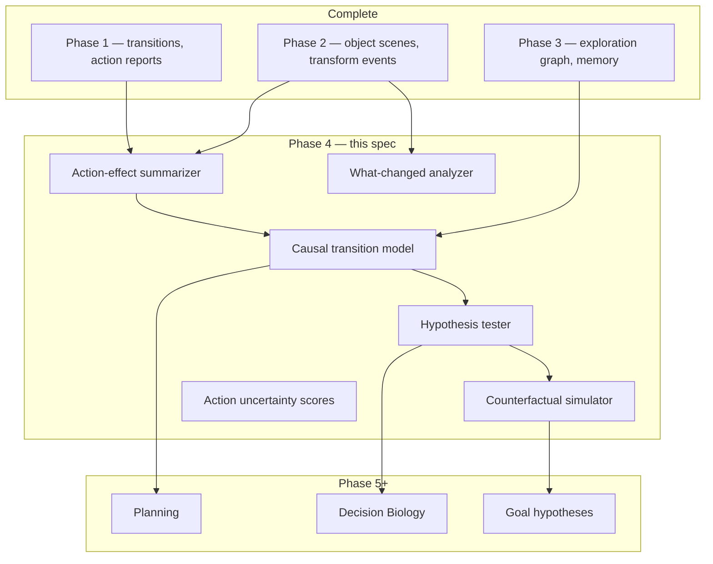

# Phase 4 — Action Semantics and Causal Inference

**Track:** Phase 4 (core ASRA roadmap)  
**Source roadmap:** `private/documents/ASRA-theory/ASRA-roadmap-datasets.md`, `ASRA-detailed-roadmap.md`  
**Timeline:** July → August 2026  
**Status:** **IN PROGRESS** — Milestones 4A, 4B, 4D implemented (see `phase4-implementation.md`)  
**Author:** Ilakkuvaselvi (Ilak) Manoharan  
**Last updated:** June 2026  
**Depends on:** Phase 1 (Experience Engine) ✅, Phase 2 (Observation Engine) ✅, Phase 3 (Navigation & Memory Engine) ✅

---

## 1. Mission

Phase 1 logs transitions without knowing what actions *mean*. Phase 2 describes *what changed structurally* (objects, transforms). Phase 3 remembers *where the agent has been* and explores efficiently. None of these layers yet answers:

> *If I take ACTION3 here, what will happen? How confident am I? What would have happened if I had taken ACTION1 instead?*

Phase 4 builds the **Semantics & Causal Inference Engine** — the layer that turns observed `(s, a, s′, r)` tuples into **action semantics**, **causal hypotheses**, and **transition predictions** so the agent can reason about interventions rather than only react to cell diffs.

```text
Phase 1:  τ = (s, a, s′, r)              — log everything
Phase 2:  Σ(s), Δ_obj                     — interpret structure
Phase 3:  G_explore, M_visit, g_sub       — remember, explore, subgoals
Phase 4:  Sem(a|s), P(s′|s,a), CF(s,a′)   — infer meaning, predict, counterfactual
Phase 5+: goal hypotheses, experiment design
```

**Primary goal:** deliver **ASRA action semantics module v1**, **causal hypothesis engine v1**, and **transition prediction module**, validated on ARC-AGI-3 transition logs and PHYRE/CLEVRER-style causal benchmarks before Phase 5 goal inference.

**Conceptual shift (from `ASRA-detailed-roadmap.md`):** Phase 4–5 is where ASRA begins to resemble **Decision Biology** in form — not yet in domain. The mapping:

```text
environment state  →  action  →  next state
cell state         →  perturbation  →  next cell state   (Phase 8)
```

Phase 4 learns **intervention–response structure** from games; Phase 8 reuses the same machinery on biological perturbation datasets.

**Non-goals for Phase 4:**

- Win-condition / goal ranking (Phase 5)
- BFS/A* / MCTS planners at competition scale (Phase 6)
- Full neural world models or LLM-based action naming
- Decision Biology datasets (LINCS, scPerturb — Phase 8)
- Replacing Phase 1 transition schema or Phase 3 exploration policy wholesale

---

## 2. Position in ASRA theory

| Phase | Cognitive role | ASRA module name |
|-------|----------------|------------------|
| 1 | Experience | Experience Engine |
| 2 | Observation | Observation Engine |
| 3 | Exploration & memory | Navigation & Memory Engine |
| 4 | **Action semantics & causality** | **Semantics & Causal Inference Engine** |
| 5 | Goal & hypothesis ranking | Hypothesis Engine |
| 6–7 | Planning & robustness | Strategy / planner stack |
| 8 | Domain: Decision Biology | Biology transition graphs |



Phase 4 is the first phase where ASRA performs **scientific-style reasoning**: form a hypothesis about an action’s effect, test it against new observations, update confidence, and simulate alternatives. Exploration memory (Phase 3) supplies **which edges are well-observed**; object scenes (Phase 2) supply **effect descriptors** richer than cell counts.

---

## 3. Why Phase 4 follows Phase 3

| After Phase 3 only | Phase 4 adds |
|--------------------|--------------|
| Novelty/usefulness rank untested actions | **Predicted effect** and **uncertainty** per action |
| `ActionSemanticsInferencer` (Kaggle stub): cell-diff buckets only | **Object-level** and **transform-class** effect models |
| Action test reports: `no_change`, `small_change`, `large_change` | Typed semantics: `RECOLOR`, `TRANSLATE`, `CREATE`, `TOGGLE`, … |
| No counterfactual reasoning | “What if ACTION1 instead of ACTION3?” |
| Exploration graph edges: avg reward, dead_end | Edges annotated with **causal strength**, **effect signature** |
| `raw_action_semantics_known: false` on all transitions | Per-game / per-state **semantics confidence** scores |

**Roadmap rationale:** *“Infer what actions mean from observed effects.”*

Phase 3 ensures the agent **samples diverse (s, a) pairs** efficiently. Phase 4 **learns from those samples** — without Phase 3’s coverage, semantics inference collapses to a handful of overfit edges.

---

## 4. Inputs from Phases 1–3

### 4.1 From Phase 1 (existing in `asra-arc/`)

| Artifact | Location | Phase 4 use |
|----------|----------|-------------|
| Transition schema | `memory/transition_schema.py` | Attach `metadata.causality` |
| Episode logger | `memory/episode_logger.py` | Batch semantics mining |
| State graph | `memory/state_graph.py` | Structural backbone for causal graph |
| Action test reports | `agent/action_tester.py`, `action_report_store.py` | **Extend** → rich effect summaries |
| Dead-end detector | `agent/dead_end_detector.py` | Negative evidence for causal models |
| Dataset exporter | `export/dataset_exporter.py` | Export semantics-enriched transitions |
| ARC-AGI-3 runner | `env/arc_agi3_runner.py` | Online semantics update |

**Phase 1 baseline (today):**

```python
# agent/action_tester.py — effect_type taxonomy (v0)
"untested" | "no_change" | "small_change" | "large_change" | "dead_end" | "repeated_state" | "terminal_transition"
```

Phase 4 **subsumes and extends** this — not a parallel taxonomy.

**Kaggle stub (today):**

```python
# ActionSemanticsInferencer in asra_phase3_my_agent.py
hypothesis ∈ {"unknown", "no-op / blocked", "localized cell update", "multi-cell transform"}
consistency_score from variance of num_changed_cells
```

Phase 4 promotes this to a **library module** with object-scene and transform-event inputs.

### 4.2 From Phase 2 (existing)

| Artifact | Location | Phase 4 use |
|----------|----------|-------------|
| `compact_scene_dict` | `perception/snapshot.py` | Effect features: `delta_num_objects` |
| Transform detection | `perception/transforms.py` | Map action → transform class multiset |
| Object extractor | `perception/objects.py` | “Which object moved?” attribution |
| Rule candidates | `perception/rules.py` | Prior templates for effect classification |

**Key insight:** Two actions with identical cell-diff statistics may differ semantically if Phase 2 reports `ROTATE` vs `RECOLOR`. Phase 4 must consume **Δ_obj**, not only `num_changed_cells`.

### 4.3 From Phase 3 (existing)

| Artifact | Location | Phase 4 use |
|----------|----------|-------------|
| Exploration graph edges | `exploration/exploration_graph.py` | Observation counts per (s, a, s′) |
| Visitation memory | `exploration/visitation_memory.py` | Weight semantics by visit confidence |
| Replay buffer | `exploration/replay.py` | Prioritize high-information edges for relabeling |
| Transition logs | `data/minigrid/`, `data/arc_exploration/` | Offline batch semantics mining |

### 4.4 Gap (what Phase 4 must add)

New package (proposed): **`src/asra/causality/`** (or `src/asra/semantics/`)

| Module | Responsibility |
|--------|----------------|
| `effect_summarizer.py` | Aggregate (s, a) → effect signature across observations |
| `transition_model.py` | Predict s′ distribution / features given (s, a) |
| `hypothesis_tester.py` | Confirm/refute effect hypotheses on new transitions |
| `counterfactual.py` | Roll forward from s with alternate action (v1: lookup + heuristic) |
| `uncertainty.py` | Epistemic uncertainty per action at state s |
| `change_analyzer.py` | Unified “what changed?” — cell + object + graph |
| `semantics_store.py` | Persistent per-game / per-state-hash semantics tables |
| `phyre_runner.py` | PHYRE adapter for causal eval |
| `clevrer_runner.py` | CLEVRER clip / question adapter (optional v1) |
| `arc_semantics.py` | Batch miner for ARC-AGI-3 JSONL logs |

---

## 5. Datasets

Per roadmap: **ARC-AGI-3 transition logs** (primary integration), **PHYRE** (physical causality), **CLEVRER** (temporal / counterfactual). Do **not** mix Procgen, Crafter, or biology yet.

### 5.1 ARC-AGI-3 transition logs

**Role:** **Ground-truth interactive domain** for ACTION1–ACTION7 semantics per game. Phase 1–3 already produce JSONL; Phase 4 **mines** them.

**Why ASRA needs it:**

| Capability | ARC logs teach |
|------------|----------------|
| Game-specific semantics | ACTION3 may mean “move cursor” in one game, “rotate” in another |
| Partial observability of effects | Same action, different contexts → conditional semantics |
| Long-horizon credit | Delayed reward after multi-step action sequence |
| Competition alignment | Direct path to Kaggle agent v0.6-phase4 |

**Use pattern:**

1. Ingest `data/transitions/*.jsonl` (mock, replay, live when available).
2. Group by `(game_id, state_hash, action)`.
3. Summarize effect signatures (cell diff + object scene delta + transform events).
4. Emit per-game **action semantics tables** JSON.
5. Attach `metadata.causality.semantic_label` and `confidence` on new transitions online.

**Data layout (proposed):**

```text
asra-arc/data/causality/arc/
  semantics/              # per-game action semantics JSON
  effect_signatures/      # clustered (s,a) effect types
  analysis/phase4/        # consistency, coverage reports
```

**Explicit non-goal:** Phase 4 does not require live API credentials to be *defined complete* — replay + mock logs suffice for module delivery.

---

### 5.2 PHYRE

**Role:** **Physical causal reasoning** — placing objects, predicting whether a task succeeds, experimentation under uncertainty.

**Why ASRA needs it:**

| Capability | PHYRE teaches |
|------------|----------------|
| Intervention reasoning | “If I add a ball here, will the flag activate?” |
| Action-effect prediction | Physical outcomes from placement |
| Experiment design | Which probe action reduces uncertainty fastest |
| Planning under uncertainty | Aligns with Phase 6 prep |

**Recommended progression:**

| Stage | PHYRE setting | Phase 4 focus |
|-------|---------------|---------------|
| A | `PHYRE-BALL` subset, single templates | Effect summarizer + success prediction |
| B | Within-template generalization | Transition model calibration |
| C | Cross-template transfer | Hypothesis tester generalization |
| D | Active experimentation policy | Tie to Phase 3 novelty (information gain) |

**Acquisition:**

```bash
pip install phyre
# optional extra: [causality] = ["phyre", ...]
```

**ASRA mapping:**

```text
PHYRE action (place ball at x,y)  →  ASRA action token
PHYRE scene state                 →  grid / object scene Σ(s)
PHYRE outcome (success/fail)      →  reward + terminal
```

**Phase 4 scope:** Adapter + batch eval of **effect prediction accuracy** and **experiment efficiency** — not full PHYRE leaderboard SOTA.

---

### 5.3 CLEVRER

**Role:** **Temporal and counterfactual reasoning** over object collisions and motion — “what would happen if the red sphere had not collided?”

**Why ASRA needs it:**

| Capability | CLEVRER teaches |
|------------|-------------------|
| Temporal cause-effect | Event A enables event B |
| Counterfactual queries | Explicit CF training signal |
| Object-centric causality | Phase 2 objects + Phase 4 causality |
| Video / step sequences | Extend transition model to sequences |

**Recommended scope (v1):**

- Start with **processed CLEVRER annotations** (collision graphs, QA labels) — not full video CNN pipeline.
- Map multiple-choice counterfactual questions to **hypothesis_tester** outcomes.
- Defer pixel-level video perception to later work.

**Explicit non-goal:** End-to-end video model training in Phase 4.

---

### 5.4 Dataset ordering (roadmap discipline)

```text
Phase 4 trains on:     ARC-AGI-3 logs → PHYRE → CLEVRER (annotations)
Phase 4 integrates:    Kaggle agent semantics hints (parallel)
Phase 4 excludes:      Procgen, Crafter, biology, Original ARC batch (Phase 2 only)
```

---

## 6. What to build (six modules + runners)

Roadmap list mapped to concrete ASRA modules.

### 6.1 Action-effect summarizer

**Purpose:** Replace coarse cell-diff buckets with **stable effect signatures** per `(game_id, state_hash, action)` or clustered state family.

**Effect signature schema (proposed):**

```python
@dataclass
class ActionEffectSignature:
    action: str
    game_id: str
    observation_count: int
    cell_change_mean: float
    cell_change_std: float
    object_delta_mean: float          # Phase 2 delta_num_objects
    transform_histogram: dict[str, int]  # e.g. {"TRANSLATE": 3, "RECOLOR": 1}
    terminal_rate: float
    dead_end_rate: float
    semantic_label: str               # inferred class
    confidence: float                 # 0–1
```

**Algorithm (v1):**

1. Collect all transitions with key `(game_id, state_hash, action)`.
2. Compute distributional stats over diffs and object scenes.
3. Run Phase 2 transform detector on `(s, s′)` pairs; aggregate histogram.
4. Cluster signatures across states (optional: object-scene fingerprint bucket).
5. Assign `semantic_label` via template matching to Phase 2 transform types + Phase 1 effect_type.

**Output:** `semantics/{game_id}.json`, attached to transition `metadata.causality.effect_signature_id`.

**Extends:** `agent/action_tester.py` — do not fork unrelated report code.

---

### 6.2 Causal transition model

**Purpose:** Predict **features of s′** given `(s, a)` — v1 uses **lookup + smoothing**, not neural nets.

**Model forms (progressive):**

| Version | Mechanism |
|---------|-----------|
| v1 | Nearest observed successor hash + feature averages |
| v1.5 | Object-scene-conditioned lookup (same Σ fingerprint) |
| v2 | Lightweight tabular model (counts → predicted Δ_obj, Δ_cells) |

**Prediction payload:**

```python
@dataclass
class TransitionPrediction:
    predicted_next_hash: str | None
    predicted_changed_cells: float
    predicted_object_delta: float
    predicted_transforms: list[str]
    probability: float
    support_count: int
```

**Integration:** Feed exploration policy — prefer actions with **high predicted progress** (usefulness) and **low uncertainty**.

---

### 6.3 Hypothesis tester

**Purpose:** Maintain explicit **causal hypotheses** and update them from new evidence.

**Hypothesis schema:**

```python
@dataclass
class CausalHypothesis:
    hypothesis_id: str
    game_id: str
    action: str
    precondition: dict[str, Any]   # object scene tags, min_changed_cells, etc.
    predicted_effect: str          # semantic_label
    support: int
    refute: int
    status: Literal["active", "confirmed", "refuted", "weak"]
```

**Update rules (v1):**

- **Confirm:** new transition matches predicted effect signature within tolerance.
- **Refute:** transform histogram diverges strongly; dead_end when progress expected.
- **Weak:** support < 3 observations.

**Output:** Hypothesis store JSON; transition metadata `metadata.causality.hypothesis_id`.

---

### 6.4 Counterfactual simulator

**Purpose:** Answer *“What if action a′ instead of a?”* from the same state s.

**v1 mechanism (non-neural):**

1. Lookup observed `(s, a′)` transitions in semantics store.
2. If unseen, fall back to transition model prediction.
3. Return ranked counterfactual outcomes with confidence flags.

**API (proposed):**

```python
def counterfactual(state_hash: str, actual_action: str, alt_action: str) -> CounterfactualResult: ...
```

**CLEVRER eval:** Map to multiple-choice options — pick outcome matching simulated CF.

**Explicit limit:** v1 does not invent novel grid states not seen in training transitions except via Phase 2 transform **templates** (future v2).

---

### 6.5 Action uncertainty score

**Purpose:** Epistemic uncertainty for each action at state s — drives exploration vs exploitation alongside Phase 3 novelty.

**Formula (v1):**

```text
uncertainty(s, a) = 1 / sqrt(1 + n_obs(s, a))
                  + w_h · 1[hypothesis status = weak]
                  + w_v · variance(effect_signature)
```

**Use:**

- High uncertainty → prioritize testing (compatible with Phase 3 novelty).
- Low uncertainty + high predicted progress → exploit.
- Export in `metadata.causality.uncertainty`.

---

### 6.6 “What changed after action?” analyzer

**Purpose:** Unified diff report merging Phase 1 cell diff, Phase 2 object/transform events, and graph-level changes.

**Output schema:**

```python
@dataclass
class ChangeReport:
    num_changed_cells: int
    object_scene_before: dict
    object_scene_after: dict
    object_events: list[dict]      # from TransformationDetector
    graph_edge_created: bool       # new node in state graph
    level_changed: bool            # ARC-AGI-3 level_id change
    summary: str                   # human-readable one-liner
```

**Role:** Single attach point for transitions and semantics mining pipeline.

**Extends:** `analysis/grid_diff.py` + Phase 2 perception pipeline.

---

## 7. System architecture

```text
                    ┌─────────────────────────────────────┐
                    │   Transition stream (Phase 1 τ)      │
                    └─────────────────┬───────────────────┘
                                      │
          ┌───────────────────────────┼───────────────────────────┐
          ▼                           ▼                           ▼
┌─────────────────┐       ┌─────────────────┐       ┌─────────────────┐
│ Phase 2 Δ_obj   │       │ Phase 3 graph   │       │ Action reports  │
│ transform events│       │ edge stats      │       │ (Phase 1)       │
└────────┬────────┘       └────────┬────────┘       └────────┬────────┘
         │                         │                         │
         └─────────────────────────┼─────────────────────────┘
                                   ▼
                    ┌─────────────────────────────────────┐
                    │      ActionEffectSummarizer          │
                    └─────────────────┬───────────────────┘
                                      ▼
                    ┌─────────────────────────────────────┐
                    │      CausalTransitionModel           │
                    └─────────────────┬───────────────────┘
                                      │
              ┌───────────────────────┼───────────────────────┐
              ▼                       ▼                       ▼
     HypothesisTester        CounterfactualSimulator    UncertaintyScorer
              │                       │                       │
              └───────────────────────┼───────────────────────┘
                                      ▼
                    ┌─────────────────────────────────────┐
                    │  ExplorationPolicyV3 / Kaggle hints  │
                    │  (semantics + Phase 3 memory)        │
                    └─────────────────────────────────────┘
```

**Policy interface (proposed):**

```python
class ExplorationPolicyV3(ExplorationPolicyV2):
    name = "exploration_v3"

    def select_action(
        self,
        state_hash: str,
        available_actions: list[str],
        graph: ExplorationGraph,
        memory: VisitationMemory,
        semantics: SemanticsStore,
        ...
    ) -> dict[str, Any]: ...
```

---

## 8. Transition metadata extension

Phase 4 enriches transitions without breaking schema:

```json
{
  "metadata": {
    "raw_action_semantics_known": true,
    "causality": {
      "effect_signature_id": "sig_042",
      "semantic_label": "localized_transform",
      "confidence": 0.82,
      "uncertainty": 0.15,
      "hypothesis_id": "hyp_ACTION3_translate",
      "predicted_changed_cells": 4.2,
      "predicted_object_delta": 0.0,
      "transform_histogram": {"TRANSLATE": 2, "IDENTITY": 1},
      "counterfactual_available": true
    },
    "exploration": { "...": "Phase 3 fields retained" }
  }
}
```

Parquet flatten columns (proposed): `semantic_label`, `causality_confidence`, `action_uncertainty`, `predicted_changed_cells`.

---

## 9. Implementation plan

### Milestone 4A — ARC semantics foundation (week 1–2)

| Task | Deliverable |
|------|-------------|
| `src/asra/causality/` package scaffold | `effect_summarizer.py`, `semantics_store.py` |
| Batch miner | `arc_semantics.py` — ingest Phase 1–3 JSONL |
| Extend `action_tester.py` | Object-aware effect types |
| CLI `build-action-semantics` | Per-game semantics JSON |
| Unit tests | Signature stability on mock transitions |

**Exit criteria:** Semantics tables for ≥1 mock game; ≥80% consistent labeling on repeated `(s, a)` pairs in replay logs.

---

### Milestone 4B — Transition model + uncertainty (week 2–3)

| Task | Deliverable |
|------|-------------|
| `CausalTransitionModel` v1 | Lookup + average features |
| `UncertaintyScorer` | Per-action scores |
| `ChangeReport` unified analyzer | Phase 1 + Phase 2 merge |
| Eval script | `eval_phase4_arc_semantics.py` |
| Attach to `ArcAGI3Runner` online | `metadata.causality` on live episodes |

**Exit criteria:** Transition prediction MAE on changed_cells below naive “global mean” baseline on held-out replay episodes.

---

### Milestone 4C — Hypotheses + counterfactuals (week 3–4)

| Task | Deliverable |
|------|-------------|
| `HypothesisTester` | Confirm/refute loop |
| `CounterfactualSimulator` v1 | Lookup-based CF |
| PHYRE adapter | `phyre_runner.py` + smoke eval |
| Report | `data/analysis/phase4/phyre_summary.json` |

**Exit criteria:** PHYRE subset — predict task success better than random with ≤20 probe actions (baseline TBD).

---

### Milestone 4D — Kaggle + CLEVRER integration (week 4+, optional)

| Task | Deliverable |
|------|-------------|
| Promote `ActionSemanticsInferencer` → library | Shared with notebook |
| Kaggle agent `asra-v0.6-phase4` | Semantics + uncertainty hints |
| CLEVRER annotation eval | CF question accuracy on subset |
| Ablation doc | With vs without semantics hints |

**Exit criteria:** Documented ablation on fixed ARC replay seeds; notebook submit-ready.

---

## 10. Success metrics

### 10.1 ARC-AGI-3 logs (primary)

| Metric | Definition | Target (initial) |
|--------|------------|------------------|
| **Semantics consistency** | Same `(s,a)` → same label | ≥80% on replay |
| **Effect prediction MAE** | \|predicted − actual\| changed_cells | Beat global-mean baseline |
| **Hypothesis confirm rate** | Confirmed / active hypotheses | Increase over episodes |
| **Uncertain action coverage** | Fraction of high-u actions tested | Correlates with info gain |

### 10.2 PHYRE (secondary)

| Metric | Definition | Target |
|--------|------------|--------|
| **Success prediction AUC** | Predict task success from probes | >0.6 on subset |
| **Probes to success** | Actions until correct placement | Lower with semantics vs Phase 3 only |

### 10.3 CLEVRER (optional)

| Metric | Definition | Target |
|--------|------------|--------|
| **CF question accuracy** | Multiple-choice counterfactual QA | Above chance on annotation subset |

### 10.4 What Phase 4 metrics are *not*

- ARC Original 800-task rule coverage (Phase 2)
- Milestone #2 win rate (Phase 6)
- Biological perturbation prediction (Phase 8)
- Leaderboard rank claims from semantics alone

---

## 11. Testing strategy

| Layer | Tests |
|-------|-------|
| Unit | Effect signature clustering; uncertainty monotonicity in n_obs |
| Integration | Replay JSONL → semantics table → prediction on held-out rows |
| Regression | Phase 1–3 tests remain green |
| Eval scripts | `eval_phase4_arc_semantics.py`, `eval_phase4_phyre.py` (planned) |

Fixtures: synthetic transition chains in `tests/fixtures/causality_micro/`.

---

## 12. Repository layout (proposed)

```text
asra-arc/
  src/asra/causality/
    __init__.py
    effect_summarizer.py
    transition_model.py
    hypothesis_tester.py
    counterfactual.py
    uncertainty.py
    change_analyzer.py
    semantics_store.py
    arc_semantics.py
    phyre_runner.py
    clevrer_eval.py
    policy_v3.py
  scripts/
    build_action_semantics.py
    eval_phase4_arc_semantics.py
    eval_phase4_phyre.py
  data/
    causality/
    analysis/phase4/

kaggle-notebooks/phase4/
  phase4-action-semantics-causal-inference.md   # this file
  README.md
  # future: asra-phase-4-arc-prize-2026.ipynb
```

**Optional dependency:**

```toml
[project.optional-dependencies]
causality = ["phyre", "gymnasium>=0.29"]
```

---

## 13. Kaggle / competition integration (preview)

Phase 4 Kaggle agent (planned `asra-v0.6-phase4`) extends Phase 3:

| Layer | Phase 3 | Phase 4 addition |
|-------|---------|------------------|
| Object hints | ✅ compact_scene | unchanged |
| Exploration hints | ✅ visit/novelty | unchanged |
| Semantics | stub inferencer | **library-backed** labels + uncertainty |
| Action choice | novelty + object + semantics variance | + **predicted progress** + **CF tie-break** |

**Reasoning string example:**

```text
ASRA Phase4: ACTION3 | objects=5 | visits=2 | sem=localized_transform | conf=0.81 | u=0.12
```

Notebook pattern: same as Phase 2–3 (bootstrap venv, write `my_agent.py`, self-test, parquet).

---

## 14. Bridge to Phase 5 and Decision Biology

| Phase 4 output | Phase 5 use | Phase 8 use |
|----------------|-------------|-------------|
| `semantic_label(action)` | Goal operator vocabulary | Perturbation class |
| `TransitionPrediction` | Progress detector | Response magnitude forecast |
| `CausalHypothesis` | Goal hypothesis ranking | Pathway hypothesis |
| `CounterfactualResult` | Experiment planner | Virtual perturbation |
| `uncertainty(s,a)` | Active goal testing | Next experiment selection |

From `ASRA-detailed-roadmap.md`:

> Phase 4–5: ASRA begins to resemble Decision Biology conceptually — intervention, hidden-state reasoning, adaptive response modeling.

Phase 4 is the **first explicit causal layer**; Phase 8 swaps grid state for cell state without swapping the inference loop.

---

## 15. Risks and mitigations

| Risk | Mitigation |
|------|------------|
| Too few `(s,a)` repeats per game | Phase 3 coverage; cluster states by object fingerprint |
| Cell-diff semantics ambiguous | Require Phase 2 transform histogram |
| PHYRE install / platform issues | Optional extra; mock physics micro-fixtures |
| CLEVRER scope creep | Annotation-only eval in v1 |
| Overfitting semantics to mock games | Hold-out replay episodes; cross-game templates |

---

## 16. Related documents

| Document | Location |
|----------|----------|
| Phase 3 spec (complete) | [`../phase3/phase3-exploration-memory-navigation.md`](../phase3/phase3-exploration-memory-navigation.md) |
| Phase 3 implementation | [`../phase3/phase3-implementation.md`](../phase3/phase3-implementation.md) |
| Phase 3 article | [`../phase3/asra-phase3-exploration-memory-navigation.md`](../phase3/asra-phase3-exploration-memory-navigation.md) |
| Phase 4 article | [`asra-phase4-action-semantics-causal-inference.md`](asra-phase4-action-semantics-causal-inference.md) |
| Phase 4 implementation | [`phase4-implementation.md`](phase4-implementation.md) |
| Kaggle notebook | [`asra-phase-4-arc-prize-2026.ipynb`](asra-phase-4-arc-prize-2026.ipynb) |
| Roadmap + datasets | `private/documents/ASRA-theory/ASRA-roadmap-datasets.md` |
| Theory arc (Decision Biology) | `private/documents/ASRA-theory/ASRA-detailed-roadmap.md` |

---

*Status: 4A–4B, 4D implemented; PHYRE 4C pending. Conceptual article: [`asra-phase4-action-semantics-causal-inference.md`](asra-phase4-action-semantics-causal-inference.md).*
