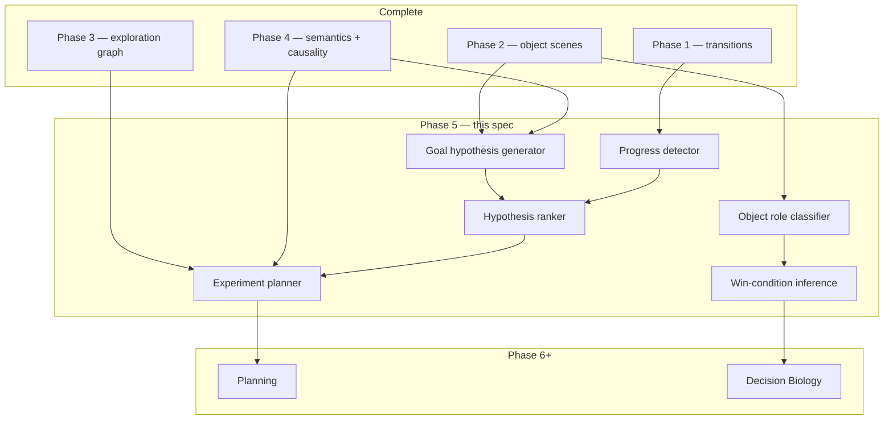
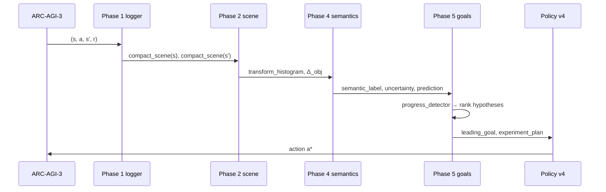

# Phase 5 — Goal Inference and Hypothesis Engine

**Track:** Phase 5 (core ASRA roadmap)  
**Source roadmap:** `private/documents/ASRA-theory/ASRA-roadmap-datasets.md`, `ASRA-detailed-roadmap.md`  
**Timeline:** August 2026  
**Status:** **SPEC COMPLETE** — library + Kaggle agent planned (`private/phase5/`)  
**Author:** Ilakkuvaselvi (Ilak) Manoharan  
**Last updated:** June 2026  
**Depends on:** Phase 1 (Experience) ✅, Phase 2 (Observation) ✅, Phase 3 (Navigation & Memory) ✅, Phase 4 (Causality) ✅

---

## 1. Mission

Phase 4 answers: *What does this action do? How confident am I? What would have happened if I had taken a different action?*

Phase 5 answers the next scientific question:

> *What is this environment trying to achieve? Which win-condition hypothesis best explains progress so far? What experiment should I run next to discriminate between competing goals?*

Phase 5 builds the **Goal Inference & Hypothesis Engine** — the layer that turns observed transitions, object scenes, action semantics, and sparse reward signals into **ranked goal hypotheses**, **progress detectors**, and **experiment plans** so the agent moves from blind exploration toward **purposeful scientific inquiry**.

```text
Phase 1:  τ = (s, a, s′, r)                    — log everything
Phase 2:  Σ(s), Δ_obj                           — interpret structure
Phase 3:  G_explore, M_visit, g_sub             — remember, explore, subgoals
Phase 4:  Sem(a|s), P(s′|s,a), CF(s,a′)         — infer meaning, predict, counterfactual
Phase 5:  G_hyp, Progress(s), Rank(G), Plan_exp — infer goals, rank, experiment
Phase 6+: BFS/A*, strategy library, Milestone #2
```

**Primary goal:** deliver **ASRA hypothesis engine v1** and **goal inference module**, validated on ARC-AGI-3, Original ARC, PHYRE, and CLEVR/CLEVRER-style object-centric benchmarks before Phase 6 planning.

**Conceptual shift (from `ASRA-detailed-roadmap.md`):** Phase 4–5 is where ASRA begins to resemble **Decision Biology** in *reasoning form* — not yet in biological datasets. Phase 4 learns intervention–response structure; Phase 5 learns **latent objectives** and **adaptive response modeling** under uncertainty:

```text
game state  →  action  →  next state  →  progress toward hidden goal
cell state  →  perturbation  →  next cell state  →  survival/adaptation objective (Phase 8)
```

**Non-goals for Phase 5:**

- Full BFS/A* / MCTS planners at competition scale (Phase 6)
- Procgen / Crafter robustness suites (Phase 7)
- Decision Biology datasets (LINCS, scPerturb — Phase 8)
- Neural goal encoders or LLM-based win-condition parsing
- Replacing Phase 4 semantics or Phase 3 exploration wholesale

---

## 2. Position in ASRA theory

| Phase | Cognitive role | ASRA module name |
|-------|----------------|------------------|
| 1 | Experience | Experience Engine |
| 2 | Observation | Observation Engine |
| 3 | Exploration & memory | Navigation & Memory Engine |
| 4 | Action semantics & causality | Semantics & Causal Inference Engine |
| 5 | **Goal & hypothesis ranking** | **Hypothesis Engine** |
| 6–7 | Planning & robustness | Strategy / planner stack |
| 8 | Domain: Decision Biology | Biology transition graphs |



Phase 5 is the first phase where ASRA performs **goal-directed scientific reasoning**: propose competing explanations for observed progress, update belief from new evidence, and select actions that **test** hypotheses rather than only explore novelty or exploit semantics.

---

## 3. Why Phase 5 follows Phase 4

| After Phase 4 only | Phase 5 adds |
|--------------------|--------------|
| Agent knows *what actions do* | Agent infers *what success requires* |
| Semantics labels: translate, recolor, … | Labels become **operators** in goal templates |
| Uncertainty drives action testing | Uncertainty drives **hypothesis discrimination** |
| Counterfactuals compare alternate actions | Counterfactuals support **experiment design** |
| Reward treated as scalar hint | Reward + level change → **progress signals** |
| Subgoals from Phase 3 (level_progress) | Subgoals become **evidence nodes** for goal ranking |

**Roadmap rationale:** *“Move from exploration to scientific reasoning.”*

Phase 4 ensures the agent has a **vocabulary of intervention effects**. Phase 5 composes those effects into **candidate win conditions** — without Phase 4 semantics, goal hypotheses collapse to undifferentiated “try anything that changes the grid.”

---

## 4. Inputs from Phases 1–4

### 4.1 From Phase 1

| Artifact | Location | Phase 5 use |
|----------|----------|-------------|
| Transition schema | `memory/transition_schema.py` | Attach `metadata.goals` |
| Episode logger | `memory/episode_logger.py` | Mine win/terminal transitions |
| State graph | `memory/state_graph.py` | Progress paths toward WIN nodes |
| Reward / terminal flags | transitions JSONL | Progress detector training signal |

### 4.2 From Phase 2

| Artifact | Location | Phase 5 use |
|----------|----------|-------------|
| `compact_scene_dict` | `perception/snapshot.py` | Object roles, spatial relations |
| Object extractor | `perception/objects.py` | Agent vs target vs token heuristics |
| Rule candidates | `perception/rules.py` | Pattern-match goal templates |
| Original ARC train pairs | `data/arc/` | Offline win-condition templates |

**Key insight:** Original ARC input→output pairs are **fully observed goal states**. Phase 5 uses them to bootstrap template libraries (match pattern, transform to goal) independent of interactive reward sparsity.

### 4.3 From Phase 3

| Artifact | Location | Phase 5 use |
|----------|----------|-------------|
| Subgoal detector | `exploration/subgoals.py` | `level_progress` as progress signal |
| Exploration graph | `exploration/exploration_graph.py` | Paths that precede WIN / reward spikes |
| Strategy reuse | `exploration/strategy_reuse.py` | Tie strategies to confirmed goal hypotheses |
| Visitation memory | `exploration/visitation_memory.py` | Avoid retesting refuted hypotheses |

### 4.4 From Phase 4

| Artifact | Location | Phase 5 use |
|----------|----------|-------------|
| `ActionEffectSignature` | `causality/effect_summarizer.py` | Operator vocabulary for goal templates |
| `TransitionPrediction` | `causality/transition_model.py` | Forecast progress under each hypothesis |
| `CausalHypothesis` | `causality/hypothesis_tester.py` | Nested under goal hypotheses |
| `CounterfactualResult` | `causality/counterfactual.py` | Experiment planner queries |
| `uncertainty(s,a)` | `causality/uncertainty.py` | Information gain for discrimination |
| `CausalExplorationPolicyV3` | `causality/policy_v3.py` | **Extend** → `GoalHypothesisPolicyV4` |

### 4.5 Gap (what Phase 5 must add)

New package (proposed): **`src/asra/goals/`**

| Module | Responsibility |
|--------|----------------|
| `schemas.py` | `GoalHypothesis`, `ProgressSignal`, `ObjectRole`, `ExperimentPlan` |
| `goal_hypothesis_generator.py` | Spawn template hypotheses from scene + semantics |
| `progress_detector.py` | Aggregate reward, level, object, pattern progress |
| `object_role_classifier.py` | Label objects: agent, target, token, hazard, key, door |
| `win_condition_inference.py` | Infer win condition from terminal / near-win transitions |
| `hypothesis_ranker.py` | Score, rank, confirm/refute goal hypotheses |
| `experiment_planner.py` | Select actions to discriminate top hypotheses |
| `goals_store.py` | Persistent per-game hypothesis JSON |
| `arc_goals.py` | Batch miner: ARC-AGI-3 logs + Original ARC pairs |
| `phyre_goals.py` | PHYRE success-template adapter |
| `clevr_goals.py` | CLEVR object-role + relational goal probes |
| `policy_v4.py` | `GoalHypothesisExplorationPolicyV4` |

---

## 5. Datasets

Per roadmap: **ARC-AGI-3**, **Original ARC**, **PHYRE**, **CLEVR / CLEVRER**. Do **not** mix Procgen, Crafter, or biology yet.

### 5.1 ARC-AGI-3

**Role:** Primary interactive domain — infer hidden win conditions per game from sparse reward and level progression.

| Capability | ARC-AGI-3 teaches |
|------------|-------------------|
| Hidden goals | Win condition not published; must be inferred |
| Progress signals | `levels_completed`, WIN state, partial grid changes |
| Game-specific goals | Same template library, different parameters per game |
| Competition integration | Direct path to Kaggle agent `asra-v0.7-phase5` |

**Use pattern:**

1. Ingest Phase 1–4 transition logs with `metadata.causality`.
2. Detect episodes with reward spikes, level changes, or WIN.
3. Retroactively score which goal hypotheses predicted progress events.
4. Rank hypotheses; attach `metadata.goals.leading_hypothesis_id` online.
5. Experiment planner selects actions with high discrimination between top-2 hypotheses.

**Data layout (proposed):**

```text
asra-arc/data/goals/arc/
  hypotheses/              # per-game ranked goal hypotheses JSON
  progress_events/         # detected progress signals
  object_roles/            # per-scene role assignments
  analysis/phase5/         # ranking accuracy, experiment efficiency reports
```

### 5.2 Original ARC

**Role:** **Fully observed goal states** — input/output grid pairs reveal target transformations without interactive sparsity.

| Capability | Original ARC teaches |
|------------|----------------------|
| Pattern-match goals | Output grid is explicit win condition |
| Transform-to-goal | Phase 2 rule candidates → goal templates |
| Object roles | Source vs target regions in train pairs |
| Offline bootstrap | Template library before live ARC-AGI-3 play |

**Use pattern:**

1. For each train pair `(input, output)`: compute Phase 2 transform events.
2. Classify task family: recolor, translate, compose, fill, crop, …
3. Emit template priors for `goal_hypothesis_generator` with high initial weight.
4. Eval: template classification accuracy vs held-out ARC tasks (not competition score).

### 5.3 PHYRE

**Role:** **Physical goal templates** — “make the ball touch the flag” with success/fail outcome.

| Capability | PHYRE teaches |
|------------|----------------|
| Success condition inference | Binary goal + continuous state |
| Experiment planning | Which placement tests goal hypothesis fastest |
| Physical object roles | Ball, barrier, flag |

**Phase 5 scope:** Adapter + eval of **goal-template match rate** and **experiments-to-success** — not full PHYRE leaderboard SOTA.

### 5.4 CLEVR / CLEVRER

**Role:** **Object-centric relational goals** — count, compare, spatial relations; CLEVRER adds temporal progress and counterfactual evidence.

| Capability | CLEVR/CLEVRER teaches |
|------------|------------------------|
| Object role classification | Sphere, cube, material, color attributes |
| Relational win conditions | “Same color as …”, “Left of …” |
| Temporal progress | Event sequences toward outcome (CLEVRER) |
| Counterfactual goal evidence | CF answers refute alternative goals |

**Recommended scope (v1):**

- CLEVR: processed scene graphs + question templates mapped to goal hypotheses.
- CLEVRER: annotation-only eval linking counterfactual outcomes to hypothesis refutation.
- Defer pixel-level perception to later work.

### 5.5 Dataset ordering

```text
Phase 5 trains on:     Original ARC (bootstrap) → ARC-AGI-3 logs → PHYRE → CLEVR/CLEVRER
Phase 5 integrates:    Kaggle agent goal hints (parallel)
Phase 5 excludes:      Procgen, Crafter, biology
```

---

## 6. What to build (six modules + runners)

Roadmap list mapped to concrete ASRA modules.

### 6.1 Goal hypothesis generator

**Purpose:** Propose **candidate win-condition explanations** from scene structure, Phase 4 semantics, and template library.

**Goal hypothesis schema:**

```python
@dataclass
class GoalHypothesis:
    hypothesis_id: str
    game_id: str
    template_id: str              # move_to_target | match_pattern | collect_tokens | ...
    description: str
    preferred_semantics: list[str]  # Phase 4 operator vocabulary
    object_roles: dict[str, str]    # object_id → role
    preconditions: dict[str, Any]   # scene tags, min objects, etc.
    support: int
    refute: int
    progress_score: float
    status: Literal["active", "leading", "confirmed", "refuted", "weak"]
    confidence: float
```

**Template library (v1):**

| template_id | Example hypothesis | Preferred semantics |
|-------------|-------------------|---------------------|
| `move_to_target` | Move agent/object to target region | translate, localized_transform |
| `match_pattern` | Transform grid to match goal pattern | recolor, multi_cell_transform |
| `collect_tokens` | Collect or remove all token objects | delete_object, translate |
| `avoid_hazard` | Reach goal while avoiding hazard cells | translate, no_op |
| `unlock_passage` | Trigger key/gate mechanism | create_object, recolor |
| `transform_to_goal` | Apply transforms until goal structure | multi_cell_transform, create_object |

**Algorithm (v1):**

1. Parse `compact_scene(s)` — object count, colors, spatial spread.
2. Load Original ARC template priors for game family (if known).
3. Spawn one hypothesis per applicable template.
4. Attach Phase 4 semantic operators as **expected progress mechanisms**.
5. Persist to `goals_store`.

**Output:** `hypotheses/{game_id}.json`

---

### 6.2 Progress detector

**Purpose:** Detect **monotonic progress** toward inferred goals from heterogeneous signals.

**Progress signal schema:**

```python
@dataclass
class ProgressSignal:
    signal_id: str
    episode_id: str
    step: int
    signal_type: str           # reward | level_up | object_aligned | pattern_match | win
    magnitude: float
    state_hash: str
    action: str
    semantic_label: str        # Phase 4
    metadata: dict[str, Any]
```

**Signal sources (v1):**

| Signal | Detection rule |
|--------|----------------|
| `reward` | `r > 0` or reward delta |
| `level_up` | `levels_completed` increases |
| `win` | terminal WIN state |
| `object_progress` | target object centroid moves toward goal region |
| `pattern_progress` | Phase 2 diff similarity to inferred output template increases |
| `token_progress` | token object count decreases |

**Integration:** Each progress event updates `progress_score` on hypotheses whose `preferred_semantics` match the causing action's Phase 4 label.

---

### 6.3 Object role classifier

**Purpose:** Assign **functional roles** to Phase 2 objects — prerequisite for spatial goal templates.

**Role taxonomy (v1):**

```text
agent | target | token | hazard | key | door | decoration | unknown
```

**Heuristics (v1 — no neural net):**

| Feature | Role hint |
|---------|-----------|
| Unique color, moves often | agent |
| Static, distinct color, at grid edge | target |
| Multiple identical small objects | token |
| Red/black near agent path | hazard |
| Disappears after specific action | key / token |
| Changes state after key action | door |

**Output:** `object_roles/{game_id}/{state_hash}.json` attached to transitions as `metadata.goals.object_roles`.

**CLEVR eval:** Compare heuristic roles to scene-graph attributes on subset.

---

### 6.4 Win-condition inference

**Purpose:** Infer **which goal template best explains** terminal and near-terminal transitions.

**Algorithm (v1):**

1. Collect all transitions in episodes ending in WIN or high reward.
2. For each transition, compute Phase 2 scene delta + Phase 4 semantics.
3. Score each active hypothesis by how well its template predicts the **sequence** of progress signals.
4. Promote top hypothesis to `leading`; refute hypotheses with consistent negative evidence.

**Original ARC offline mode:**

- Input/output pair defines win condition directly.
- Win-condition = transform rule from Phase 2 `rule_candidates`.
- Provides supervised upper bound for template classification eval.

---

### 6.5 Hypothesis ranking system

**Purpose:** Maintain a **belief distribution** over goal hypotheses and update from evidence.

**Ranking score (v1):**

```text
score(h) = w_p · progress_score(h)
         + w_s · support(h)
         - w_r · refute(h)
         + w_c · semantics_consistency(h)
         + w_t · template_prior(h)
```

**Update rules:**

- **Support:** progress signal matches hypothesis preferred semantics.
- **Refute:** repeated progress-free applications of hypothesized operators; or WIN achieved while hypothesis predicted different mechanism.
- **Leading:** top score among active hypotheses; exported in agent reasoning string.
- **Confirmed:** WIN reached and progress path consistent with hypothesis (weak confirmation in v1).
- **Refuted:** explicit counter-evidence or dominated by alternative.

**Output:** Ranked list in `goals_store`; transition field `metadata.goals.leading_template_id`.

---

### 6.6 Experiment planner

**Purpose:** Select **next action** to maximally discriminate between top competing hypotheses — scientific experiment design.

**Experiment plan schema:**

```python
@dataclass
class ExperimentPlan:
    plan_id: str
    state_hash: str
    candidate_actions: list[str]
    target_hypotheses: list[str]   # usually top-2
    discrimination_scores: dict[str, float]
    chosen_action: str
    rationale: str
```

**Algorithm (v1):**

1. Take top-2 ranked hypotheses `h₁`, `h₂`.
2. For each candidate action `a`, get Phase 4 semantics + uncertainty.
3. Score discrimination: `|match(a, h₁) - match(a, h₂)| × uncertainty(s, a)`.
4. Prefer actions with high discrimination **and** untested or high-uncertainty edges.
5. Fall back to Phase 4 exploration policy when all hypotheses weak.

**Integration with Kaggle agent:**

```text
score(action) = Phase1–4_terms
              + GOAL_HINT_WEIGHT · action_goal_score(leading_hypothesis, sem)
              + EXPERIMENT_HINT_WEIGHT · discrimination_bonus(top-2, sem, u)
```

---

## 7. End-to-end data flow



**Online loop (competition agent):**

1. Observe grid → Phase 2 scene.
2. Ensure goal hypotheses spawned for game (once per episode).
3. Phase 4 infer semantics per candidate action.
4. Phase 5 score actions by leading hypothesis alignment + discrimination bonus.
5. Execute action; on transition, update progress + re-rank.
6. Reasoning string cites `goal=move_to_target` (or leading template).

**Offline loop (research CLI):**

```bash
cd asra-arc
PYTHONPATH=src python3 -m asra build-goal-hypotheses \
  --transitions-dir data/transitions \
  --arc-tasks-dir data/arc/original \
  --output-dir data/goals/arc

PYTHONPATH=src python3 -m asra eval-phase5-arc \
  --hypotheses-dir data/goals/arc/hypotheses \
  --output data/analysis/phase5/arc_goals_eval.json
```

---

## 8. Milestones

| Milestone | Deliverable | Acceptance criteria |
|-----------|-------------|---------------------|
| **5A** | `goals/` package + schemas | Unit tests for generator, ranker, progress detector |
| **5B** | Original ARC template bootstrap | ≥60% task-family template match on train split (heuristic baseline) |
| **5C** | ARC-AGI-3 goal mining | Hypotheses JSON per game; progress events logged |
| **5D** | Experiment planner + policy v4 | Discrimination score unit tests; MiniGrid optional hook |
| **5E** | PHYRE + CLEVR eval adapters | Goal-template eval reports (secondary) |
| **5F** | Kaggle agent `asra-v0.7-phase5` | Self-test pass; notebook submit package in `private/phase5/` |

---

## 9. Evaluation metrics

### 9.1 ARC-AGI-3

| Metric | Intent |
|--------|--------|
| Leading hypothesis stability | Same leading template across replay of episode tail |
| Progress correlation | Fraction of progress events matching leading hypothesis semantics |
| Experiments to discrimination | Steps until top-2 hypotheses separate by score margin |
| WIN hindsight accuracy | Leading template at WIN would have been ranked top-3 |

### 9.2 Original ARC

| Metric | Intent |
|--------|--------|
| Template classification accuracy | Predict task family from input grid alone |
| Rule–goal alignment | Phase 2 rule candidate matches inferred template |

### 9.3 PHYRE / CLEVR

| Metric | Intent |
|--------|--------|
| Success-template match | Inferred goal matches PHYRE task type |
| Object role accuracy | CLEVR heuristic roles vs attributes |
| CLEVRER refute rate | Counterfactual evidence updates ranking |

### 9.4 What Phase 5 metrics are not

- Milestone #2 win rate (Phase 6)
- Procgen generalization (Phase 7)
- Biological perturbation prediction (Phase 8)

---

## 10. Kaggle / competition integration

Phase 5 Kaggle agent (`asra-v0.7-phase5`) extends Phase 4:

| Layer | Phase 4 | Phase 5 addition |
|-------|---------|------------------|
| Object hints | ✅ | unchanged |
| Exploration hints | ✅ | unchanged |
| Causal semantics | ✅ labels, uncertainty | unchanged |
| **Goal inference** | — | **templates, ranking, progress** |
| **Experiment hints** | — | **discrimination bonus** |

**Reasoning string example:**

```text
ASRA Phase5: ACTION3 | objects=5 | visits=2 | sem=translate conf=0.81 u=0.12 | goal=move_to_target
```

**Package location:** `private/phase5/`

| File | Role |
|------|------|
| `asra_phase5_my_agent.py` | Competition agent with embedded `GoalHypothesisEngine` |
| `asra-phase-5-arc-prize-2026.ipynb` | Submit notebook |
| `build_phase5_kaggle_notebook.py` | Regenerate notebook from agent source |
| `kernel-metadata.json` | Kaggle kernel metadata |

**Build & self-test:**

```bash
cd private/phase5
python3 build_phase5_kaggle_notebook.py
python3 asra_phase5_my_agent.py --self-test
```

---

## 11. Bridge to Phase 6 and Decision Biology

| Phase 5 output | Phase 6 use | Phase 8 use |
|----------------|-------------|-------------|
| Leading goal hypothesis | Planner objective function | Survival/adaptation objective |
| Object roles | Subgoal decomposition | Gene/pathway roles |
| Progress detector | Heuristic for plan repair | Response magnitude tracking |
| Experiment planner | Active planning queries | Next perturbation selection |
| Ranked hypotheses | Strategy library indexing | Pathway hypothesis ranking |

From `ASRA-detailed-roadmap.md`:

> Phase 4–5: ASRA begins to resemble Decision Biology conceptually — hidden-state reasoning, hypothesis generation, adaptive response modeling.

Phase 5 is where **latent objectives** enter the loop — the direct precursor to modeling cellular **survival and adaptation goals** in Phase 8.

---

## 12. Risks and mitigations

| Risk | Mitigation |
|------|------------|
| Sparse reward → no progress signal | Original ARC bootstrap; level_change + object_progress proxies |
| Too many templates → noise | Template priors from ARC; cap active hypotheses at 6–8 |
| Wrong leading hypothesis locks agent | Keep exploration/experiment terms; refute on counter-evidence |
| Object role heuristics brittle | CLEVR eval; fall back to geometry-only templates |
| Competition score unchanged | Phase 5 is reasoning infrastructure; Milestone #2 is Phase 6 |

---

## 13. Related documents

| Document | Location |
|----------|----------|
| Phase 4 spec | `kaggle-notebooks/phase4/phase4-action-semantics-causal-inference.md` |
| Phase 4 article | `kaggle-notebooks/phase4/asra-phase4-action-semantics-causal-inference.md` |
| Phase 5 article (theory) | [`asra-phase5-goal-inference-hypothesis-engine.md`](asra-phase5-goal-inference-hypothesis-engine.md) |
| Phase 5 implementation | [`phase5-implementation.md`](phase5-implementation.md) |
| Kaggle notebook | [`asra-phase-5-arc-prize-2026.ipynb`](asra-phase-5-arc-prize-2026.ipynb) |
| Roadmap + datasets | `private/documents/ASRA-theory/ASRA-roadmap-datasets.md` |
| Theory arc | `private/documents/ASRA-theory/ASRA-detailed-roadmap.md` |

---

*Status: specification complete in `private/phase5/`; library implementation in `asra-arc/src/asra/goals/` is the next engineering step after spec sign-off.*
