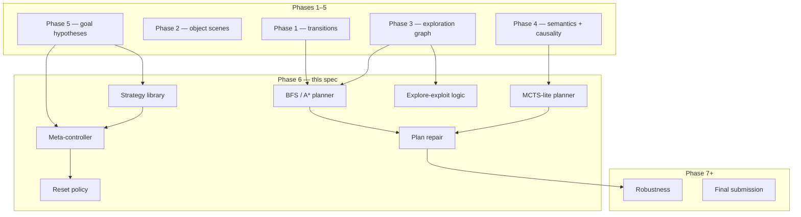
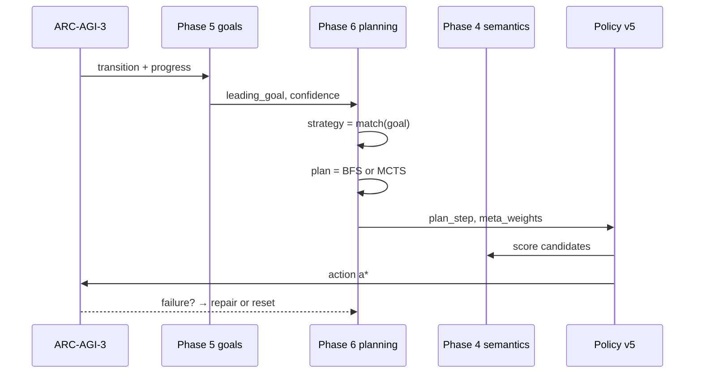

# Phase 6 — Planning and Strategy Invention

**Track:** Phase 6 (core ASRA roadmap)  
**Source roadmap:** `private/documents/ASRA-theory/ASRA-roadmap-datasets.md`, `ASRA-detailed-roadmap.md`  
**Timeline:** August → September 30, 2026  
**Status:** **SPEC COMPLETE** — library scaffold + Kaggle agent planned (`kaggle-notebooks/phase6/`)  
**Author:** Ilakkuvaselvi (Ilak) Manoharan  
**Last updated:** June 2026  
**Depends on:** Phase 1 (Experience) ✅, Phase 2 (Observation) ✅, Phase 3 (Navigation & Memory) ✅, Phase 4 (Causality) ✅, Phase 5 (Goals) ✅

---

## 1. Mission

Phase 5 answers: *What is this environment trying to achieve? Which goal hypothesis best explains progress? What experiment discriminates competing goals?*

Phase 6 answers the next operational question:

> *Given a leading goal hypothesis, how do I compose actions into a multi-step plan? When should I explore vs exploit? How do I recover when a plan fails?*

Phase 6 builds the **Planning & Strategy Invention Engine** — the layer that turns ranked goal hypotheses, semantic operators, and observed transition graphs into **executable plans**, **reusable strategies**, and **meta-level control** so the agent moves from purposeful inquiry toward **competition-grade task completion**.

```text
Phase 1:  τ = (s, a, s′, r)                    — log everything
Phase 2:  Σ(s), Δ_obj                           — interpret structure
Phase 3:  G_explore, M_visit, g_sub             — remember, explore, subgoals
Phase 4:  Sem(a|s), P(s′|s,a), CF(s,a′)         — infer meaning, predict, counterfactual
Phase 5:  G_hyp, Progress(s), Rank(G), Plan_exp — infer goals, rank, experiment
Phase 6:  Plan(s,g), Strat(g), Meta(E/E), Repair — plan, strategize, adapt
Phase 7+: Robustness, generalization, final submission
```

**Primary goal:** deliver **ASRA v0.8** with a **strategy library** and **Milestone #2 submission** — a stronger ARC-AGI-3 agent that plans over semantic operators rather than only scoring single actions.

**Conceptual shift:** Phase 5 supplies the *objective function*; Phase 6 supplies *control*. The planner does not replace exploration or goal inference — it **orchestrates** them under a meta-controller that balances novelty, discrimination, and plan execution.

**Non-goals for Phase 6:**

- Full neural world models or learned value functions (deferred)
- Procgen/DMLab robustness suites (Phase 7)
- Decision Biology datasets (Phase 8)
- Replacing Phase 5 goal ranking or Phase 4 semantics wholesale
- Claiming final competition win rate (Phase 9 integrates and tunes)

---

## 2. Position in ASRA theory

| Phase | Cognitive role | ASRA module name |
|-------|----------------|------------------|
| 1 | Experience | Experience Engine |
| 2 | Observation | Observation Engine |
| 3 | Exploration & memory | Navigation & Memory Engine |
| 4 | Action semantics & causality | Semantics & Causal Inference Engine |
| 5 | Goal & hypothesis ranking | Hypothesis Engine |
| 6 | **Planning & strategy invention** | **Planning Engine** |
| 7 | Robustness & generalization | Robustness Engine |
| 8 | Decision Biology bridge | Biology transition graphs |



Phase 6 is where ASRA becomes **action-sequence competent**: single-step scoring becomes multi-step lookahead over observed and predicted transitions, indexed by reusable strategy templates.

---

## 3. Why Phase 6 follows Phase 5

| After Phase 5 only | Phase 6 adds |
|--------------------|--------------|
| Leading goal hypothesis guides action hints | Hypothesis becomes **planner objective** |
| Experiment planner picks discriminating actions | Meta-controller picks **explore vs exploit vs plan** |
| Progress signals update belief | Progress signals trigger **plan repair** and **reset** |
| Phase 3 subgoals are evidence | Subgoals become **plan milestones** |
| Phase 4 predictions are local | Predictions seed **BFS/A* edges** and **MCTS rollouts** |
| No multi-step commitment | **Strategy library** commits to operator sequences |

**Roadmap rationale:** *"Submit stronger ASRA agent for Milestone #2."*

Without Phase 5 objectives, planners optimize toward arbitrary graph reachability. Without Phase 4 semantics, plan edges lack meaning. Phase 6 closes the loop: **goal → strategy → plan → action**.

---

## 4. Inputs from Phases 1–5

### 4.1 From Phase 1

| Artifact | Location | Phase 6 use |
|----------|----------|-------------|
| Transition schema | `memory/transition_schema.py` | Attach `metadata.planning` |
| State graph | `memory/state_graph.py` | BFS/A* edge lookup |
| Episode logger | `memory/episode_logger.py` | Plan success/failure mining |
| WIN / terminal states | transitions JSONL | Goal state sets for planners |

### 4.2 From Phase 2

| Artifact | Location | Phase 6 use |
|----------|----------|-------------|
| `compact_scene_dict` | `perception/snapshot.py` | Plan preconditions, object alignment checks |
| Object extractor | `perception/objects.py` | Spatial subgoals in `reach_target` strategy |
| Transform events | `perception/transforms.py` | `transform` / `align` strategy triggers |

### 4.3 From Phase 3

| Artifact | Location | Phase 6 use |
|----------|----------|-------------|
| Exploration graph | `exploration/exploration_graph.py` | BFS frontier; novelty for meta-controller |
| Visitation memory | `exploration/visitation_memory.py` | Explore-exploit signal |
| Subgoal detector | `exploration/subgoals.py` | Plan milestones (`level_progress`) |
| Strategy reuse | `exploration/strategy_reuse.py` | Seed strategy library from past wins |

### 4.4 From Phase 4

| Artifact | Location | Phase 6 use |
|----------|----------|-------------|
| `TransitionPrediction` | `causality/transition_model.py` | Hypothetical edges when graph sparse |
| `uncertainty(s,a)` | `causality/uncertainty.py` | Meta-controller explore trigger |
| `CounterfactualResult` | `causality/counterfactual.py` | Plan repair counterfactual checks |
| `CausalExplorationPolicyV3` | `causality/policy_v3.py` | **Extend** → `PlanningPolicyV5` |

### 4.5 From Phase 5

| Artifact | Location | Phase 6 use |
|----------|----------|-------------|
| Leading `GoalHypothesis` | `goals/hypothesis_ranker.py` | Planner objective + strategy match |
| `ProgressSignal` | `goals/progress_detector.py` | Plan progress heuristic |
| `ExperimentPlan` | `goals/experiment_planner.py` | Fallback when plan empty |
| Object roles | `goals/object_role_classifier.py` | Strategy parameterization |

### 4.6 Gap (what Phase 6 must add)

New package: **`asra-arc/src/asra/planning/`**

| Module | Responsibility |
|--------|----------------|
| `schemas.py` | `Plan`, `PlanStep`, `Strategy`, `PlannerMode` |
| `bfs_planner.py` | BFS over observed transition graph |
| `astar_planner.py` | A* with semantic + goal heuristic (v1 lightweight) |
| `mcts_planner.py` | `MCTSPlannerLite` — semantic rollouts |
| `strategy_library.py` | Map goal templates → strategies |
| `meta_controller.py` | Explore-exploit mode + weight blending |
| `reset_policy.py` | Episode/game reset triggers |
| `plan_repair.py` | Drop failed steps; replan from current state |
| `planning_store.py` | Per-game plan cache JSON |
| `arc_planner.py` | ARC-AGI-3 batch plan eval |
| `minigrid_planner.py` | Navigation planning adapter |
| `procgen_runner.py` | Procgen layout-variation smoke tests |
| `crafter_runner.py` | Long-horizon resource-planning adapter |
| `policy_v5.py` | `PlanningExplorationPolicyV5` |

---

## 5. Datasets

Per roadmap: **ARC-AGI-3**, **MiniGrid**, **Procgen**, **Crafter**. Do **not** mix DMLab, NetHack, or biology yet.

### 5.1 ARC-AGI-3

**Role:** Primary competition benchmark — real interactive planning under hidden goals.

| Capability | ARC-AGI-3 teaches |
|------------|-------------------|
| Game-specific planning | Same strategy library, different parameters |
| Sparse graphs | BFS over observed edges; MCTS when graph incomplete |
| WIN reachability | Terminal states as planner goal sets |
| Milestone #2 | Direct Kaggle integration `asra-v0.8-phase6` |

**Use pattern:**

1. Ingest Phase 1–5 logs; build per-game transition subgraph.
2. Map leading goal template → strategy via `StrategyLibrary.match`.
3. Run BFS from current state toward WIN-adjacent hashes (if known).
4. On BFS failure, fall back to MCTS-lite over Phase 4 semantics.
5. Meta-controller blends plan score with exploration and goal hints.

**Data layout:**

```text
asra-arc/data/planning/arc/
  plans/                   # per-episode plan JSON
  strategies/              # per-game strategy selection history
  analysis/phase6/         # plan success rate, steps-to-WIN reports
```

### 5.2 MiniGrid

**Role:** **Navigation and memory planning** — short horizons, partial observability, clear spatial goals.

| Capability | MiniGrid teaches |
|------------|------------------|
| Reach-target planning | `reach_target` strategy stress test |
| Door/key sequences | `unlock` strategy composition |
| Visitation + BFS | Phase 3 graph → Phase 6 planner validation |

**Use pattern:** `minigrid_planner.py` adapter; eval plan length vs optimal path on fixed seeds.

### 5.3 Procgen

**Role:** **Generalization to unseen layouts** — anti-memorization probe for planners (full robustness suite in Phase 7).

| Capability | Procgen teaches |
|------------|-----------------|
| Layout variation | Strategy transfer without per-level memorization |
| Procedural goals | Goal-template → strategy mapping under shift |
| Planner degradation | When BFS graph resets per episode |

**Phase 6 scope:** Smoke tests + plan-success rate on held-out seeds — not full Procgen leaderboard.

### 5.4 Crafter

**Role:** **Long-horizon strategy** — resource planning, goal hierarchy, sequential decision-making.

| Capability | Crafter teaches |
|------------|-----------------|
| Multi-step sequences | `sequence` strategy over many timesteps |
| Resource subgoals | Hierarchical plan milestones |
| Reset policy | When to abandon plan and re-explore |

**Phase 6 scope:** Adapter + qualitative plan-chain eval; tune `max_depth` and reset thresholds.

### 5.5 Dataset ordering

```text
Phase 6 trains on:     ARC-AGI-3 logs → MiniGrid → Procgen smoke → Crafter long-horizon
Phase 6 integrates:    Kaggle agent planning layer (parallel)
Phase 6 excludes:      DMLab, NetHack, biology (later phases)
```

---

## 6. What to build (seven modules + runners)

### 6.1 BFS / A* planner

**Purpose:** Find shortest action sequences over **observed** transitions toward goal states.

**Plan schema** (from `planning/schemas.py`):

```python
@dataclass
class Plan:
    plan_id: str
    game_id: str
    start_state_hash: str
    goal_template_id: str | None
    steps: list[PlanStep]
    mode: PlannerMode          # bfs | greedy | mcts_lite
    success: bool
```

**BFS (v1):** `BFSPlanner` — max depth 6; goal set = known WIN hashes + reward-spike states.

**A* (v1):** `AStarPlanner` — heuristic = semantic alignment with leading strategy + distance in exploration graph.

**Output:** `plans/{game_id}/{episode_id}.json`

---

### 6.2 MCTS-lite planner

**Purpose:** When the transition graph is sparse, **roll out** candidate actions using Phase 4 semantic scores.

**Algorithm (v1 — `MCTSPlannerLite`):**

1. Match goal template → strategy.
2. For each candidate action, score = `strategy.score_action(sem_label) + confidence × 0.3 + noise`.
3. Run `rollouts` (default 8); pick highest mean score.
4. Emit single `PlanStep` (replan each timestep — not full tree search).

**When to use:** BFS returns `success=False` or frontier empty.

---

### 6.3 Strategy library

**Purpose:** Reusable **strategy patterns** indexed by Phase 5 goal templates.

**Default strategies** (`strategy_library.py`):

| Strategy | Maps from goal template | Preferred semantics |
|----------|------------------------|---------------------|
| `reach_target` | `move_to_target` | translate |
| `collect` | `collect_tokens` | delete_object, translate |
| `align` | spatial alignment subgoals | localized_transform |
| `avoid` | `avoid_hazard` | no_op, translate |
| `unlock` | `unlock_passage` | create_object, recolor |
| `transform` | `match_pattern`, `transform_to_goal` | multi_cell_transform, recolor |
| `sequence` | multi-step compositions | translate, recolor |
| `explore` | weak / unknown goals | unknown |

**Roadmap output alignment:** *reach target, collect, align, avoid, unlock, transform, sequence*.

---

### 6.4 Meta-controller

**Purpose:** **Explore-exploit-plan** mode selection given coverage and goal confidence.

**Modes (`MetaController`):**

| Mode | Trigger | Weight blend |
|------|---------|--------------|
| `explore` | `visit_count ≤ 2` or `uncertainty > 0.35` | ↑ exploration, ↓ plan |
| `exploit` | `goal_confidence > 0.7` | ↑ goal, ↑ plan |
| `balanced` | default | equal weights |

**Integration:**

```text
score(action) = w_explore · novelty
              + w_goal · goal_alignment
              + w_plan · plan_step_match
              + w_sem · semantics
```

---

### 6.5 Explore-vs-exploit decision logic

**Purpose:** Formalize when to **discriminate goals** (Phase 5) vs **execute plans** (Phase 6).

**Rules (v1):**

1. If leading hypothesis `confidence < 0.4` → prefer Phase 5 experiment planner.
2. If `confidence ≥ 0.4` and valid plan exists → prefer plan first step.
3. If plan step fails (no state change) → increment stuck counter; trigger repair.
4. If meta mode = `explore` → cap plan weight at 0.4.

---

### 6.6 Reset policy

**Purpose:** Decide when to **abandon** current plan/strategy and restart exploration.

**Triggers (`ResetPolicy`):**

| Condition | Action |
|-----------|--------|
| `stuck_count ≥ 5` | Clear plan cache; boost exploration |
| `actions ≥ max_actions` | Soft reset — new strategy draw |
| Plan repair exhausted | Episode-level strategy switch |

Reset does **not** clear goal hypotheses — only plan execution state.

---

### 6.7 Plan repair system

**Purpose:** Recover from **failed plan steps** without full replan from scratch.

**Algorithm (`PlanRepairSystem`):**

1. Remove failed action from remaining `plan.steps`.
2. Re-run BFS from current state with reduced depth budget.
3. If repair fails, fall back to MCTS-lite single step.
4. Log `metadata.planning.repair_count` on transition.

**Progress hook:** Phase 5 `ProgressSignal` on repair success restores plan weight.

---

## 7. End-to-end data flow



**Online loop (competition agent):**

1. Load leading goal hypothesis from Phase 5.
2. Select strategy; attempt BFS plan toward WIN-adjacent states.
3. Meta-controller sets explore/exploit weights.
4. Score actions: plan step match + goal + semantics + exploration.
5. On failure: repair → reset → strategy switch (ordered).
6. Reasoning string cites `plan=bfs:3` or `strat=reach_target`.

**Offline loop (research CLI):**

```bash
cd asra-arc
PYTHONPATH=src python3 -m asra build-plans \
  --transitions-dir data/transitions \
  --goals-dir data/goals/arc/hypotheses \
  --output-dir data/planning/arc

PYTHONPATH=src python3 -m asra eval-phase6-arc \
  --plans-dir data/planning/arc/plans \
  --output data/analysis/phase6/arc_planning_eval.json

PYTHONPATH=src python3 -m asra run-minigrid-planning \
  --episodes 50 --output data/planning/minigrid/
```

---

## 8. Milestones

| Milestone | Deliverable | Acceptance criteria |
|-----------|-------------|---------------------|
| **6A** | `planning/` package + schemas | Unit tests for BFS, strategy match, meta-controller |
| **6B** | Strategy library + goal mapping | All 7 roadmap strategies mapped to Phase 5 templates |
| **6C** | MCTS-lite + plan repair | Repair removes failed step; MCTS picks action on empty BFS |
| **6D** | MiniGrid + Procgen adapters | Plan success rate reports on fixed seeds |
| **6E** | Crafter long-horizon eval | Sequence strategy chains ≥10 steps without stuck reset |
| **6F** | Kaggle agent `asra-v0.8-phase6` | Self-test pass; **Milestone #2 submission** |

---

## 9. Evaluation metrics

### 9.1 ARC-AGI-3 (primary — Milestone #2)

| Metric | Intent |
|--------|--------|
| Win rate | Competition score vs Phase 5 baseline |
| Average actions to win | Planning efficiency |
| Plan success rate | Fraction of episodes where BFS/MCTS plan used |
| Steps on plan vs off-plan | Meta-controller calibration |
| Strategy match accuracy | Leading goal → correct strategy at WIN hindsight |

### 9.2 MiniGrid

| Metric | Intent |
|--------|--------|
| Path length vs optimal | BFS quality on navigation |
| Unlock sequence success | Multi-step `unlock` strategy |

### 9.3 Procgen / Crafter

| Metric | Intent |
|--------|--------|
| Transfer plan success | Held-out seed generalization (Procgen) |
| Long-horizon survival | Crafter achievement unlock rate with `sequence` |

### 9.4 What Phase 6 metrics are not

- Full generalization dashboard (Phase 7)
- Biological perturbation prediction (Phase 8)
- Final research narrative completeness (Phase 9)

---

## 10. Kaggle / competition integration

Phase 6 Kaggle agent (`asra-v0.8-phase6`) extends Phase 5:

| Layer | Phase 5 | Phase 6 addition |
|-------|---------|------------------|
| Goal inference | ✅ templates, ranking | unchanged |
| Experiment hints | ✅ discrimination | deprioritized when plan active |
| **Planning** | — | **BFS/MCTS-lite, plan step match** |
| **Strategy** | — | **strategy name in reasoning** |
| **Meta-control** | — | **explore/exploit weight blend** |

**Reasoning string example:**

```text
ASRA Phase6: ACTION3 | objects=5 | sem=translate conf=0.81 | goal=move_to_target | strat=reach_target | plan=bfs:2/4 | mode=exploit
```

**Package location:** `kaggle-notebooks/phase6/`

| File | Role |
|------|------|
| `asra_phase6_my_agent.py` | Competition agent with embedded `PlanningEngine` |
| `asra-phase-6-arc-prize-2026.ipynb` | Submit notebook |
| `build_phase6_kaggle_notebook.py` | Regenerate notebook from agent source |
| `kernel-metadata.json` | Kaggle kernel metadata |

**Build & self-test:**

```bash
cd kaggle-notebooks/phase6
python3 build_phase6_kaggle_notebook.py
python3 asra_phase6_my_agent.py --self-test
```

---

## 11. Bridge to Phase 7 and Decision Biology

| Phase 6 output | Phase 7 use | Phase 8 use |
|----------------|-------------|-------------|
| Plan failure logs | Failure analyzer input | Perturbation sequence failures |
| Stuck / reset events | Stuck detector calibration | Assay retry policies |
| Strategy library | Cross-game transfer eval | Pathway strategy templates |
| Meta-controller weights | Generalization dashboard | Experiment batch scheduling |
| MCTS semantic rollouts | Action waste reducer | Pathway hypothesis scoring |

Phase 6 is the **last phase optimizing for competition win rate** before Phase 7 shifts emphasis to robustness and Phase 8 opens the scientific extension.

---

## 12. Risks and mitigations

| Risk | Mitigation |
|------|------------|
| Sparse transition graph → empty BFS | MCTS-lite fallback; Phase 4 predicted edges (low weight) |
| Wrong goal → wrong strategy | Keep Phase 5 experiment mode when confidence low |
| Plan commitment causes loops | Plan repair + stuck counter + reset policy |
| Competition timeout | Cap BFS depth at 6; single-step MCTS default |
| Crafter/Procgen scope creep | Smoke tests only; full suite deferred to Phase 7 |

---

## 13. Related documents

| Document | Location |
|----------|----------|
| Phase 5 spec | `kaggle-notebooks/phase5/phase5-goal-inference-hypothesis-engine.md` |
| Phase 6 article (theory) | [`asra-phase6-planning-strategy-invention.md`](asra-phase6-planning-strategy-invention.md) |
| Phase 6 implementation | [`phase6-implementation.md`](phase6-implementation.md) |
| Kaggle notebook | [`asra-phase-6-arc-prize-2026.ipynb`](asra-phase-6-arc-prize-2026.ipynb) |
| Roadmap + datasets | `private/documents/ASRA-theory/ASRA-roadmap-datasets.md` |
| Library | `asra-arc/src/asra/planning/` |

---

*Status: specification complete; Milestone #2 target is `asra-v0.8-phase6` with embedded `PlanningEngine` and full `planning/` library.*
