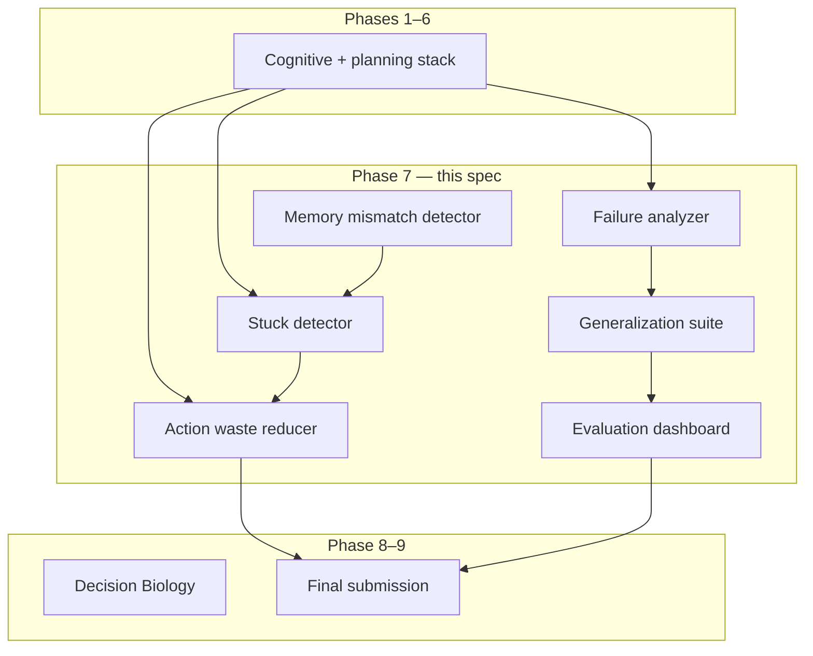
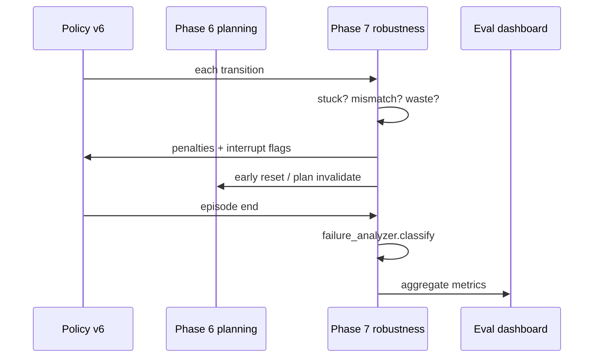

# Phase 7 — Robustness and Generalization

**Track:** Phase 7 (core ASRA roadmap)  
**Source roadmap:** `private/documents/ASRA-theory/ASRA-roadmap-datasets.md`, `ASRA-detailed-roadmap.md`  
**Timeline:** October 2026  
**Status:** **SPEC COMPLETE** — library scaffold + Kaggle agent planned (`kaggle-notebooks/phase7/`)  
**Author:** Ilakkuvaselvi (Ilak) Manoharan  
**Last updated:** June 2026  
**Depends on:** Phases 1–6 ✅

---

## 1. Mission

Phase 6 answers: *How do I plan multi-step action sequences toward a leading goal? When do I explore vs exploit? How do I repair failed plans?*

Phase 7 answers the reliability question:

> *Where does the agent fail on unseen layouts? When is memory misleading? How do I detect stuck loops and wasted actions before they cost a win?*

Phase 7 builds the **Robustness & Generalization Engine** — diagnostic and corrective layers atop the full cognitive stack so ASRA performs consistently across procedural variation, long horizons, and memory–perception mismatch before the **final ARC-AGI-3 submission** in Phase 9.

```text
Phase 1–5:  perceive, remember, infer, hypothesize
Phase 6:    plan, strategize, repair
Phase 7:    diagnose failures, detect stuck/waste, generalize, dashboard
Phase 8–9:  Decision Biology bridge, final submission
```

**Primary goal:** deliver **ASRA v0.85** as the **final candidate agent** backbone — hardened by systematic failure analysis, cross-environment generalization benchmarks, and an evaluation dashboard.

**Conceptual shift:** Phase 6 optimizes *capability*; Phase 7 optimizes *reliability*. The robustness layer does not replace planning — it **monitors, interrupts, and reroutes** when the stack degrades.

**Non-goals for Phase 7:**

- New planning algorithms (Phase 6 scope)
- Decision Biology datasets (Phase 8)
- Final Kaggle packaging and research narrative (Phase 9)
- NetHack full integration unless time permits (optional advanced)
- Neural domain adaptation or fine-tuning

---

## 2. Position in ASRA theory

| Phase | Cognitive role | ASRA module name |
|-------|----------------|------------------|
| 1–5 | Experience → goals | Core cognitive stack |
| 6 | Planning & strategy | Planning Engine |
| 7 | **Robustness & generalization** | **Robustness Engine** |
| 8 | Decision Biology | Biology transition graphs |
| 9 | Final integration | Full stack + narrative |



Phase 7 is ASRA's **quality assurance layer**: it turns episodic failures into structured reports that drive meta-controller retuning, reset thresholds, and final agent selection.

---

## 3. Why Phase 7 follows Phase 6

| After Phase 6 only | Phase 7 adds |
|--------------------|--------------|
| Plans succeed on familiar games | **Cross-seed** and **cross-layout** failure profiles |
| Reset on stuck counter | **Stuck detector** with memory-mismatch awareness |
| Strategy library fixed | **Transfer metrics** across levels and environments |
| Win rate on ARC-AGI-3 | **Decomposed metrics**: actions-to-win, exploration cost, hypothesis accuracy |
| Ad hoc debugging | **Evaluation dashboard** with reproducible reports |
| Plan repair local | **Failure analyzer** clusters systemic patterns |

**Roadmap rationale:** *"Prepare final ARC-AGI-3 submission."*

Milestone #2 (Phase 6) proves the agent *can* plan. Phase 7 proves it *generalizes* and *recovers* under stress — the bar for a defensible final submission.

---

## 4. Inputs from Phases 1–6

### 4.1 From Phase 1

| Artifact | Location | Phase 7 use |
|----------|----------|-------------|
| Transition logs | `data/transitions/` | Failure mining, waste detection |
| Episode summaries | `analysis/episode_summary.py` | Dashboard aggregates |
| State graph | `memory/state_graph.py` | Dead-end cluster analysis |

### 4.2 From Phase 3

| Artifact | Location | Phase 7 use |
|----------|----------|-------------|
| Visitation memory | `exploration/visitation_memory.py` | Memory mismatch baseline |
| Exploration graph | `exploration/exploration_graph.py` | Exploration cost metric |
| Novelty scores | `exploration/novelty.py` | Over-exploration detection |

### 4.3 From Phase 5

| Artifact | Location | Phase 7 use |
|----------|----------|-------------|
| Hypothesis ranker | `goals/hypothesis_ranker.py` | Hypothesis accuracy at failure |
| Progress detector | `goals/progress_detector.py` | No-progress failure typing |
| Leading template | `metadata.goals` | Wrong-goal failure classification |

### 4.4 From Phase 6

| Artifact | Location | Phase 7 use |
|----------|----------|-------------|
| Plan cache | `planning/planning_store.py` | Planner stuck detection |
| Reset events | `planning/meta_controller.py` | Reset frequency metrics |
| Strategy history | `planning/strategy_library.py` | Strategy transfer analysis |
| Plan repair logs | `metadata.planning` | Repair exhaustion failures |

### 4.5 Gap (what Phase 7 must add)

New package: **`asra-arc/src/asra/robustness/`**

| Module | Responsibility |
|--------|----------------|
| `schemas.py` | `FailureReport`, `StuckEvent`, `WasteEvent`, `GeneralizationResult` |
| `failure_analyzer.py` | Cluster dead-ends, no-progress, wrong-goal failures |
| `generalization_suite.py` | Cross-seed Procgen, DMLab, ARC level transfer |
| `memory_mismatch.py` | Detect when visitation memory disagrees with perception |
| `stuck_detector.py` | Repeat-state and plan-loop detection |
| `action_waste.py` | Penalize zero-effect action repetition |
| `eval_dashboard.py` | HTML/JSON dashboard from batch eval runs |
| `arc_robustness.py` | ARC-AGI-3 batch robustness runner |
| `procgen_runner.py` | Layout-variation benchmark |
| `dmlab_runner.py` | Long-term memory stress (optional depth) |
| `nethack_runner.py` | Sparse-reward optional probe |
| `policy_v6.py` | `RobustPlanningPolicyV6` — wraps Phase 6 with guards |

---

## 5. Datasets

Per roadmap: **ARC-AGI-3**, **Procgen**, **DMLab**, **NetHack (optional)**.

### 5.1 ARC-AGI-3

**Role:** Primary benchmark — final candidate agent evaluation before Phase 9 packaging.

| Capability | ARC-AGI-3 teaches |
|------------|-------------------|
| Per-game failure modes | Failure analyzer taxonomy |
| Level transfer | Hypothesis + strategy persistence across levels |
| Competition readiness | Agent tag `asra-v0.85-phase7` |

**Metrics (roadmap):** win rate, average actions to win, exploration cost, hypothesis accuracy, transfer across levels, planner success rate.

**Data layout:**

```text
asra-arc/data/robustness/arc/
  failures/                # per-episode failure reports JSON
  stuck_events/            # stuck detector triggers
  dashboard/               # aggregated eval HTML + JSON
  analysis/phase7/         # cross-game failure clusters
```

### 5.2 Procgen

**Role:** **Generalization and anti-memorization** — procedural layout variation.

| Capability | Procgen teaches |
|------------|-----------------|
| Layout shift | Strategy transfer without memorized paths |
| Seed holdout | Train eval seeds vs test seeds |
| Planner degradation | BFS graph reset per episode |

**Use pattern:**

1. Run Phase 6 agent on seed set A; log failures.
2. Evaluate on held-out seed set B without re-tuning.
3. Report `GeneralizationResult`: win rate delta, stuck rate delta.

### 5.3 DMLab

**Role:** **Long-term memory** and **3D-navigation-style** procedural exploration (abstracted to ASRA transition logs).

| Capability | DMLab teaches |
|------------|---------------|
| Extended horizons | Stuck detector at long episodes |
| Memory mismatch | Visitation vs revisited room disambiguation |
| Exploration cost | Actions per reward unit |

**Phase 7 scope:** Adapter producing ASRA-compatible transitions; dashboard integration — not full DMLab SOTA.

### 5.4 NetHack (optional)

**Role:** **Sparse reward**, inventory-style reasoning, extreme long-horizon — only if schedule allows.

| Capability | NetHack teaches |
|------------|-----------------|
| Ultra-sparse progress | No-progress failure dominance |
| Inventory state | Memory mismatch stress (future) |

**Default:** Specified but **disabled** in v1 CI; stub `nethack_runner.py`.

### 5.5 Dataset ordering

```text
Phase 7 evaluates:    ARC-AGI-3 (primary) → Procgen → DMLab → NetHack optional
Phase 7 integrates:    Kaggle agent robustness guards (parallel)
Phase 7 excludes:      Biology datasets (Phase 8)
```

---

## 6. What to build (six modules + dashboard)

### 6.1 Failure analyzer

**Purpose:** Cluster and classify **why episodes fail** — dead-ends, no progress, wrong goal, planner exhaustion.

**Failure report schema:**

```python
@dataclass
class FailureReport:
    episode_id: str
    failure_type: str       # dead_end | no_progress | wrong_goal | plan_exhausted | timeout
    count: int
    metadata: dict[str, Any]  # state_hash, action, leading_template, plan_mode
```

**Algorithm (v1 — `FailureAnalyzer`):**

1. On each transition: if `changed_cells == 0` and `reward ≤ 0` → increment dead-end counter.
2. On episode end without WIN: classify by dominant signal (stuck, no progress streak, wrong leading template at tail).
3. Emit `top_failures(n)` for dashboard and policy tuning.

**Output:** `failures/{game_id}_summary.json`

---

### 6.2 Generalization benchmark suite

**Purpose:** Reproducible **cross-environment** eval harness.

**`GeneralizationResult` schema:**

```python
@dataclass
class GeneralizationResult:
    benchmark: str          # procgen | dmlab | arc_levels
    train_metric: float
    test_metric: float
    delta: float
    episodes: int
    metadata: dict[str, Any]
```

**Suite contents:**

| Benchmark | Train | Test | Primary metric |
|-----------|-------|------|----------------|
| Procgen | seeds 0–99 | seeds 100–199 | win rate |
| ARC levels | levels 1–N/2 | levels N/2+1–N | actions to win |
| DMLab | maze A | maze B | exploration cost |

**CLI:**

```bash
PYTHONPATH=src python3 -m asra run-generalization-suite \
  --benchmark procgen --train-seeds 0-99 --test-seeds 100-199 \
  --output data/robustness/procgen/generalization.json
```

---

### 6.3 Memory mismatch detector

**Purpose:** Flag when **visitation memory** or **cached semantics** disagree with current perception.

**Mismatch signals (v1):**

| Signal | Detection |
|--------|-----------|
| Object count drift | Phase 2 object count ≠ cached scene signature |
| Stale semantics | Phase 4 label confidence drops on repeated `(s,a)` |
| Ghost visitation | High visit count but grid hash changed substantially |
| Role flip | Phase 5 object role changed without progress event |

**Action:** Boost exploration weight; invalidate plan cache; optionally clear semantics for `(s,a)`.

**Module:** `memory_mismatch.py` — consumes Phase 2 snapshot + Phase 3 visitation + Phase 4 store.

---

### 6.4 Planner stuck detector

**Purpose:** Detect **loops** and **plan non-progress** before reset budget exhausted.

**Stuck signals (`StuckDetector`):**

| Signal | Threshold |
|--------|-----------|
| State repeat | `visit_count(state) ≥ 4` |
| Action loop | same `(s,a)` with zero effect ≥ 3 times |
| Plan oscillation | plan repair count ≥ 3 in 10 steps |
| No progress streak | Phase 5 progress-free steps ≥ 8 |

**Integration:** Feeds `ResetPolicy` (Phase 6) with earlier triggers when mismatch detected.

---

### 6.5 Action waste reducer

**Purpose:** Penalize **zero-effect** and **redundant** actions in policy scoring.

**Waste event schema:**

```python
@dataclass
class WasteEvent:
    state_hash: str
    action: str
    waste_type: str    # no_effect | redundant_visit | duplicate_semantic
    penalty: float
```

**Policy integration (`policy_v6.py`):**

```text
score(action) = Phase6_score - WASTE_PENALTY · waste_count(s,a)
```

**Rules:**

1. If `(s,a)` in dead-end set with count ≥ 2 → hard penalty.
2. If semantic label repeats with no progress → soft penalty.
3. If action matches failed plan step already tried → medium penalty.

---

### 6.6 Evaluation dashboard

**Purpose:** Single **HTML + JSON** report aggregating Phase 7 metrics for agent comparison.

**Dashboard panels:**

| Panel | Source |
|-------|--------|
| Win rate by game | ARC batch eval |
| Actions to win distribution | Episode summaries |
| Failure type breakdown | Failure analyzer |
| Stuck rate over time | Stuck detector logs |
| Generalization delta | Generalization suite |
| Hypothesis accuracy at WIN | Phase 5 eval |
| Planner success rate | Phase 6 plan logs |
| Exploration cost | Phase 3 novelty integrals |

**Output:** `data/robustness/dashboard/index.html` + `summary.json`

**CLI:**

```bash
PYTHONPATH=src python3 -m asra build-eval-dashboard \
  --robustness-dir data/robustness \
  --output data/robustness/dashboard/
```

---

## 7. End-to-end data flow



**Online loop (competition agent):**

1. Wrap Phase 6 policy with `RobustPlanningPolicyV6`.
2. Each step: stuck detector + waste reducer update.
3. On mismatch: invalidate plan; boost explore.
4. On stuck: trigger Phase 6 reset early.
5. Reasoning string cites `stuck=0 waste=1 mismatch=0`.

**Offline loop:**

```bash
cd asra-arc
PYTHONPATH=src python3 -m asra eval-phase7-arc \
  --transitions-dir data/transitions \
  --output data/analysis/phase7/arc_robustness_eval.json

PYTHONPATH=src python3 -m asra build-eval-dashboard \
  --robustness-dir data/robustness
```

---

## 8. Milestones

| Milestone | Deliverable | Acceptance criteria |
|-----------|-------------|---------------------|
| **7A** | `robustness/` package + schemas | Unit tests for failure, stuck, waste |
| **7B** | Failure analyzer + ARC batch | Top failure types per game reported |
| **7C** | Stuck + memory mismatch guards | Agent self-test reduces loop episodes |
| **7D** | Procgen generalization suite | Train/test delta report generated |
| **7E** | DMLab adapter (optional depth) | Long-horizon stuck metrics logged |
| **7F** | Eval dashboard + Kaggle `asra-v0.85-phase7` | Dashboard HTML; self-test pass |

---

## 9. Evaluation metrics

### 9.1 Roadmap metrics (primary)

| Metric | Definition |
|--------|------------|
| Win rate | Fraction of episodes ending in WIN |
| Average actions to win | Mean steps in successful episodes |
| Exploration cost | Mean novelty-weighted steps before first progress |
| Hypothesis accuracy | Leading template matches WIN hindsight |
| Transfer across levels | Win rate on held-out levels / games |
| Planner success rate | Fraction of plan steps achieving predicted change |

### 9.2 Robustness-specific

| Metric | Definition |
|--------|------------|
| Stuck rate | Episodes with ≥1 stuck event / total |
| Waste ratio | Wasted actions / total actions |
| Failure cluster purity | Dominant failure type explains ≥60% per game |
| Generalization delta | `test_win_rate - train_win_rate` on Procgen |
| Mismatch interrupt rate | Memory mismatch flags per 100 steps |
| Reset efficiency | WIN rate after reset vs without |

### 9.3 What Phase 7 metrics are not

- Biological perturbation AUC (Phase 8)
- Final paper completeness (Phase 9)
- NetHack leaderboard (optional only)

---

## 10. Kaggle / competition integration

Phase 7 Kaggle agent (`asra-v0.85-phase7`) extends Phase 6:

| Layer | Phase 6 | Phase 7 addition |
|-------|---------|------------------|
| Planning | ✅ BFS/MCTS | unchanged |
| **Robustness guards** | — | **stuck, waste, mismatch** |
| **Failure logging** | — | **compact failure_type in metadata** |
| Meta-control | ✅ explore/exploit | **earlier reset on stuck** |

**Reasoning string example:**

```text
ASRA Phase7: ACTION2 | goal=collect_tokens | strat=collect | plan=mcts:1 | stuck=0 waste=0 mismatch=0 guard=ok
```

**Package location:** `kaggle-notebooks/phase7/`

| File | Role |
|------|------|
| `asra_phase7_my_agent.py` | Embedded `RobustnessEngine` wrapping `PlanningEngine` |
| `asra-phase-7-arc-prize-2026.ipynb` | Submit notebook |
| `build_phase7_kaggle_notebook.py` | Notebook builder |

**Build & self-test:**

```bash
cd kaggle-notebooks/phase7
python3 build_phase7_kaggle_notebook.py
python3 asra_phase7_my_agent.py --self-test
```

---

## 11. Bridge to Phase 8 and Phase 9

| Phase 7 output | Phase 8 use | Phase 9 use |
|----------------|-------------|-------------|
| Failure taxonomy | Perturbation failure analog | Eval report section |
| Generalization methodology | Cross-cell-line transfer | Research story evidence |
| Dashboard framework | Biology eval panels | Final submission artifact |
| Stuck/waste policies | Assay redundancy reduction | Agent tuning for final tag |
| Procgen delta metrics | Layout-agnostic pathway claims | Architecture diagram caption |

Phase 7 produces the **evidence base** Phase 9 needs for a credible evaluation report and agent selection (`asra-v0.85-phase7` → `asra-v1.0-phase9`).

---

## 12. Risks and mitigations

| Risk | Mitigation |
|------|------------|
| Over-aggressive waste penalty blocks exploration | Cap penalty; exempt high-uncertainty actions |
| DMLab adapter scope | Optional milestone; ARC + Procgen sufficient for v1 |
| Dashboard complexity | JSON-first; HTML template minimal |
| False stuck on valid backtracking | Distinguish repeat state with progress events |
| NetHack time sink | Stub only; enable flag default off |

---

## 13. Related documents

| Document | Location |
|----------|----------|
| Phase 6 spec | `kaggle-notebooks/phase6/phase6-planning-strategy-invention.md` |
| Phase 7 article (theory) | [`asra-phase7-robustness-generalization.md`](asra-phase7-robustness-generalization.md) |
| Phase 7 implementation | [`phase7-implementation.md`](phase7-implementation.md) |
| Kaggle notebook | [`asra-phase-7-arc-prize-2026.ipynb`](asra-phase-7-arc-prize-2026.ipynb) |
| Roadmap + datasets | `private/documents/ASRA-theory/ASRA-roadmap-datasets.md` |
| Library | `asra-arc/src/asra/robustness/` |

---

*Status: specification complete; `asra-v0.85-phase7` is the final candidate backbone before Phase 9 integration.*
