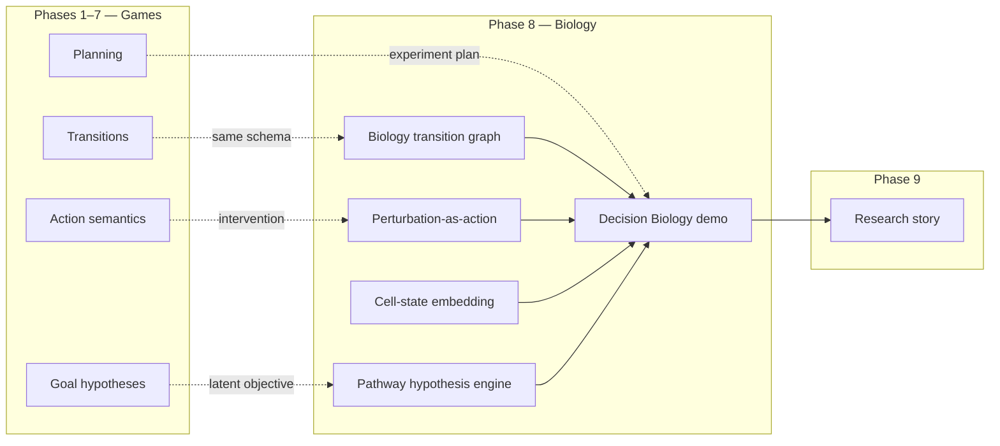
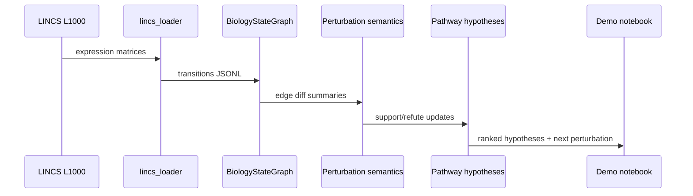

# Phase 8 — Decision Biology Bridge

**Track:** Phase 8 (core ASRA roadmap)  
**Source roadmap:** `private/documents/ASRA-theory/ASRA-roadmap-datasets.md`, `ASRA-detailed-roadmap.md`  
**Timeline:** October → November 2026 (parallel with final writeup)  
**Status:** **SPEC COMPLETE** — library exists + demo notebook planned (`kaggle-notebooks/phase8/`)  
**Author:** Ilakkuvaselvi (Ilak) Manoharan  
**Last updated:** June 2026  
**Depends on:** Phases 1–7 ✅

---

## 1. Mission

Phases 1–7 built and hardened an **adaptive reasoning stack for interactive grid worlds**. Phase 8 asks the cross-domain question:

> *Can the same transition-centric reasoning loop — state, intervention, next state, latent objective — explain perturbation–response biology?*

Phase 8 builds the **Decision Biology Bridge** — a parallel domain layer that maps ASRA's cognitive primitives onto **cell states**, **perturbations**, and **pathway hypotheses**, demonstrating that the architecture extends beyond games into **scientific intervention reasoning** for the Nature Foundation Models narrative.

```text
Game:     environment state  →  action  →  next environment state  →  hidden goal
Biology:  cell state         →  perturbation  →  next cell state       →  survival objective
```

**Primary goal:** deliver **ASRA Decision Biology extension** with a working **demo notebook**, biological transition graph prototype, and pathway hypothesis engine — parallel to competition work, not blocking Kaggle sandbox execution.

**Conceptual shift:** Phase 8 is **not** a replacement agent for ARC. It is an **isomorphic extension**: reuse Phase 1 transition schema, Phase 4 intervention semantics, Phase 5 objective inference, and Phase 6 experiment sequencing on biological data.

**Non-goals for Phase 8:**

- Training large biological foundation models
- Replacing dedicated bioinformatics pipelines (OmniPath, DESeq2, etc.)
- Full single-cell atlas embedding SOTA
- Live Kaggle dependency on external biology APIs
- Claiming clinical predictive performance

---

## 2. Position in ASRA theory

| Phase | Domain | ASRA module |
|-------|--------|-------------|
| 1–7 | Interactive environments | Core + planning + robustness |
| 8 | **Decision Biology** | `decision_biology/` package |
| 9 | Integration + narrative | Full story across both domains |



Phase 8 makes the Phase 4–5 Decision Biology analogy **operational** with real datasets (LINCS, OmniPath, scPerturb, Cell Painting, HCA).

---

## 3. Why Phase 8 follows Phase 7

| After Phase 7 only | Phase 8 adds |
|--------------------|--------------|
| Game-only narrative | **Scientific extension** with shared architecture |
| Grid state hashes | **Cell-state identifiers** and gene activity vectors |
| ACTION1–5 semantics | **Perturbation-as-action** (compound, CRISPR, cytokine) |
| Goal templates | **Pathway survival hypotheses** |
| Competition metrics | **Perturbation–response prediction** metrics |
| ARC eval dashboard | **Biology demo** notebook + pathway graph viz |

**Roadmap rationale:** *"Show how ASRA extends beyond games into scientific reasoning."*

Phase 7 finalizes game robustness; Phase 8 opens the **second domain** for Phase 9's research story and Nature Foundation Models positioning.

---

## 4. Core mapping (game ↔ biology)

| ASRA primitive | Game instantiation | Biology instantiation |
|----------------|-------------------|----------------------|
| State `s` | Grid frame + objects | Gene activity vector / cell embedding |
| Action `a` | ACTION1–5 | Perturbation (drug, CRISPR, cytokine) |
| Next state `s′` | Next grid frame | Post-perturbation expression profile |
| Reward `r` | WIN, level, score | Viability, proliferation, pathway activation |
| State hash | Grid hash | `state_hash` from gene signature |
| Semantics | translate, recolor, … | upregulate, inhibit, bypass, rescue |
| Goal hypothesis | move_to_target, … | survival, apoptosis resistance, pathway X active |
| Experiment plan | discriminating action | next perturbation in combo screen |
| Transition graph | `state_graph.json` | `biology_state_graph.json` |

---

## 5. Inputs from Phases 1–7 (reused abstractions)

| Phase | Reused concept | Biology use |
|-------|----------------|-------------|
| 1 | Transition schema | `state → perturbation → next_state → reward` |
| 1 | State graph structure | `BiologyStateGraph` edges |
| 4 | Effect signatures | Perturbation effect on gene subsets |
| 4 | Uncertainty | Low-replicate perturbation confidence |
| 5 | Hypothesis ranking | Pathway hypothesis scores |
| 5 | Experiment planner | Next perturbation selection |
| 6 | Strategy library | Pathway intervention strategies |
| 7 | Failure analyzer | Non-responder / dead perturbation clusters |

**Library location:** **`asra-arc/src/asra/decision_biology/`**

| Module (existing / planned) | Responsibility |
|------------------------------|----------------|
| `biology_state_graph.py` | Biological transition graph (reuses edge schema) |
| `state_hash.py` | Cell-state hash from gene activities |
| `lincs_loader.py` | LINCS L1000 perturbation–response ingest |
| `lincs_experiment.py` | LINCS experiment runner |
| `omnipath_loader.py` | Signaling pathway graph load |
| `pathway_simulator.py` | Pathway dynamics lightweight sim |
| `pathway_hypothesis.py` | Pathway survival hypothesis ranking |
| `experiment.py` | Perturbation experiment orchestration |
| `cell_embedding.py` | Cell-state embedding layer (planned) |
| `scp_perturb_adapter.py` | scPerturb CRISPR adapter (planned) |
| `cell_painting_adapter.py` | Morphological state adapter (planned) |
| `hca_context.py` | HCA context grounding (planned) |
| `demo_notebook.py` | Decision Biology demo entrypoint (planned) |

---

## 6. Datasets

Per roadmap: **LINCS L1000**, **OmniPath**, **scPerturb**, **Cell Painting**, **Human Cell Atlas (HCA)**.

### 6.1 LINCS L1000

**Role:** Primary **perturbation–response** corpus — drug and genetic perturbations with expression readouts.

| Capability | LINCS teaches |
|------------|---------------|
| Action-effect inference | Perturbation → differential expression signature |
| State transitions | Pre/post expression as `(s, a, s′)` |
| Biological semantics | Up/down-regulation patterns per pathway |

**Use pattern:**

1. Load perturbation metadata + expression via `lincs_loader.py`.
2. Build `BiologyStateGraph` edges per cell line.
3. Infer perturbation semantics (analogous to Phase 4).
4. Rank pathway hypotheses on response magnitude.

**Data layout:**

```text
asra-arc/data/decision_biology/lincs/
  raw/                     # downloaded LINCS subsets
  transitions/             # ASRA-format JSONL
  graphs/                  # biology_state_graph.json per cell line
  analysis/phase8/         # perturbation prediction reports
```

### 6.2 OmniPath

**Role:** **Signaling graph** prior — causal structure between genes/pathways.

| Capability | OmniPath teaches |
|------------|------------------|
| Pathway causal structure | Graph constraints on hypothesis space |
| Latent world model | Edges for `pathway_simulator.py` |
| Mechanism hypotheses | "Inhibiting A should block B activation" |

**Use pattern:** Load via `omnipath_loader.py`; attach to `pathway_hypothesis.py` as structural priors.

### 6.3 scPerturb

**Role:** **CRISPR perturbation** at single-cell resolution — before/after cell states.

| Capability | scPerturb teaches |
|------------|-------------------|
| Single-cell transitions | Fine-grained `s → s′` |
| Intervention modeling | Genetic perturbation as action |
| Heterogeneous response | Hypothesis ranking per cell type |

**Phase 8 scope:** Adapter stub + eval on public subset; full atlas-scale deferred.

### 6.4 Cell Painting

**Role:** **Morphological state representation** — visual biological response patterns.

| Capability | Cell Painting teaches |
|------------|----------------------|
| Morphology as state | Image embedding → cell-state vector |
| Visual response patterns | Bridge to Phase 2 object-centric intuition |
| Cross-modal grounding | Morphology + expression joint hash |

**Phase 8 scope:** Embedding hook in `cell_embedding.py`; demo figure for Phase 9 deck.

### 6.5 Human Cell Atlas (HCA)

**Role:** **Cell-state context** — latent state discovery and biological grounding.

| Capability | HCA teaches |
|------------|-------------|
| Cell-type manifolds | Context for perturbation interpretation |
| Latent state discovery | Unseen cell-state neighborhood |
| Reference atlas | Prior for pathway hypothesis instantiation |

**Phase 8 scope:** Context vectors for demo; not full atlas integration.

### 6.6 Dataset ordering

```text
Phase 8 builds on:     LINCS (core) → OmniPath → scPerturb → Cell Painting → HCA context
Phase 8 integrates:    Decision Biology demo notebook (parallel to Kaggle)
Phase 8 excludes:      Competition-critical path (agent runs without biology data)
```

---

## 7. What to build (five modules + demo)

### 7.1 Biological transition graph prototype

**Purpose:** Reuse ASRA's **state graph schema** for non-grid transitions.

**`BiologyStateGraph`** (`biology_state_graph.py`):

- Nodes: `state_hash`, `gene_activities`, `pathway_id`, `visit_count`
- Edges: `perturbation_name`, `count`, `avg_reward`, `diff_summary.num_changed_genes`

**Output:** `data/decision_biology/graphs/{cell_line}.json`

**Parallel to:** `memory/state_graph.py` (Phase 1).

---

### 7.2 Perturbation-as-action representation

**Purpose:** Map biological interventions to ASRA **action** schema.

**Action schema extension:**

```python
@dataclass
class PerturbationAction:
    name: str                    # e.g. "BRD-K12343256", "CRISPR_TP53"
    action_type: str             # compound | crispr | cytokine | control
    target_genes: list[str]
    dose: float | None
    metadata: dict[str, Any]
```

**Semantics (Phase 4 analog):**

| Semantic label | Biological reading |
|----------------|-------------------|
| `upregulate_pathway` | Activates target pathway genes |
| `inhibit_pathway` | Suppresses pathway activity |
| `bypass_node` | Compensatory activation downstream |
| `rescue_viability` | Restores survival metric |
| `no_response` | Expression change below threshold |

**Module:** extend `experiment.py` + `lincs_experiment.py`.

---

### 7.3 Cell-state embedding layer

**Purpose:** Compact **cell-state identifier** analogous to grid `state_hash`.

**`cell_embedding.py` (planned):**

1. Input: gene activity vector (LINCS) or morphology features (Cell Painting).
2. Normalize + top-k gene signature.
3. Hash via `state_hash.py` → `cell_state_id`.
4. Optional: PCA/UMAP cache for demo visualization.

**Output:** `cell_states/{cell_line}/{state_hash}.json`

---

### 7.4 Pathway hypothesis engine

**Purpose:** Phase 5 **goal inference** on biological objectives.

**Pathway hypothesis schema:**

```python
@dataclass
class PathwayHypothesis:
    hypothesis_id: str
    cell_line: str
    pathway_id: str              # from OmniPath
    objective: str               # survival | apoptosis | proliferation
    preferred_perturbations: list[str]
    support: int
    refute: int
    confidence: float
    status: str
```

**Ranking (v1 — `pathway_hypothesis.py`):**

```text
score(h) = w_r · response_magnitude(h) + w_p · pathway_prior(h) - w_c · contradiction(h)
```

**Experiment planner analog:** select next perturbation maximizing discrimination between top-2 pathway hypotheses — reuses Phase 5 `experiment_planner` logic.

---

### 7.5 Decision Biology demo notebook

**Purpose:** End-to-end **narrative artifact** for Phase 9 research story.

**Demo flow:**

1. Load LINCS subset for one cell line.
2. Build biology transition graph (10–20 perturbations).
3. Overlay OmniPath pathway priors.
4. Rank pathway hypotheses on held-out perturbations.
5. Visualize: graph + hypothesis scores + predicted vs observed response.
6. Side-by-side: ARC transition graph vs biology transition graph (same schema).

**Locations:**

- Library: `asra-arc/notebooks/decision_biology_demo.ipynb` (planned)
- Kaggle companion: `kaggle-notebooks/phase8/asra-phase-8-arc-prize-2026.ipynb` (agent tag only; biology in markdown cells / offline outputs)

---

## 8. End-to-end data flow



**Offline loop (research CLI):**

```bash
cd asra-arc
PYTHONPATH=src python3 -m asra ingest-lincs \
  --subset demo_cell_lines --output data/decision_biology/lincs/

PYTHONPATH=src python3 -m asra build-biology-graph \
  --transitions-dir data/decision_biology/lincs/transitions \
  --output data/decision_biology/graphs/

PYTHONPATH=src python3 -m asra eval-phase8-pathways \
  --graph-dir data/decision_biology/graphs \
  --omnipath data/decision_biology/omnipath/ \
  --output data/analysis/phase8/pathway_eval.json
```

---

## 9. Milestones

| Milestone | Deliverable | Acceptance criteria |
|-----------|-------------|---------------------|
| **8A** | LINCS ingest + transition JSONL | ≥100 transitions in ASRA schema |
| **8B** | `BiologyStateGraph` + viz | Graph save/load; node/edge counts match |
| **8C** | Perturbation semantics v1 | Top perturbations labeled consistently |
| **8D** | Pathway hypothesis engine | Rank hypotheses; hold-out perturbation eval |
| **8E** | OmniPath + scPerturb hooks | Pathway priors affect ranking |
| **8F** | Decision Biology demo + Kaggle `asra-v0.9-phase8` | Demo notebook runs; agent self-test pass |

---

## 10. Evaluation metrics

### 10.1 Perturbation–response

| Metric | Intent |
|--------|--------|
| Response direction accuracy | Predict up/down regulation sign |
| Top-k gene overlap | Predicted vs observed DE genes |
| Transition hash stability | Same cell state → same hash |

### 10.2 Pathway hypotheses

| Metric | Intent |
|--------|--------|
| Pathway rank @k | True active pathway in top-k |
| Discrimination efficiency | Perturbations to separate top-2 hypotheses |
| OmniPath prior lift | Ranking improves with graph priors |

### 10.3 Cross-domain analogy

| Metric | Intent |
|--------|--------|
| Schema compatibility | Biology transitions validate against Phase 1 schema |
| Module reuse count | Phases 4–5 logic invoked without game-specific code |

### 10.4 What Phase 8 metrics are not

- ARC competition win rate (Phase 6–7)
- Clinical trial prediction
- Full HCA embedding benchmark

---

## 11. Kaggle / competition integration

Phase 8 Kaggle agent (`asra-v0.9-phase8`) extends Phase 7 **without requiring biology data in sandbox**:

| Layer | Phase 7 | Phase 8 addition |
|-------|---------|------------------|
| Robust planning | ✅ | unchanged |
| **Biology bridge metadata** | — | **reasoning tag `bio=bridge`** |
| **Isomorphism hooks** | — | **shared transition schema constants** |

**Reasoning string example:**

```text
ASRA Phase8: ACTION3 | goal=move_to_target | strat=reach_target | guard=ok | bio=bridge_active
```

The competition agent carries **bridge identity** and schema hooks; the **demo notebook** carries the science.

**Package location:** `kaggle-notebooks/phase8/`

```bash
cd kaggle-notebooks/phase8
python3 build_phase8_kaggle_notebook.py
python3 asra_phase8_my_agent.py --self-test
```

---

## 12. Bridge to Phase 9

| Phase 8 output | Phase 9 use |
|----------------|-------------|
| Decision Biology demo | Research story § "Beyond games" |
| Pathway eval report | Evaluation report appendix |
| Schema isomorphism diagram | Architecture diagram dual domain |
| LINCS/OmniPath figures | Deck + paper visuals |
| `decision_biology/` package | GitHub README scientific extension |

Phase 9 integrates phases 1–8 into a **single narrative**: ARC agent + biological extension.

---

## 13. Risks and mitigations

| Risk | Mitigation |
|------|------------|
| Biology data size / licensing | LINCS demo subset; public OmniPath |
| Kaggle sandbox no network | Biology fully offline in research repo |
| Overclaiming bio performance | Demo-scale eval; clear v1 limitations |
| Schema mismatch | Validate all biology JSONL against `transition_schema.py` |
| Scope creep into ML training | Hypothesis ranking only; no foundation model training |

---

## 14. Related documents

| Document | Location |
|----------|----------|
| Phase 7 spec | `kaggle-notebooks/phase7/phase7-robustness-generalization.md` |
| Phase 8 article (theory) | [`asra-phase8-decision-biology-bridge.md`](asra-phase8-decision-biology-bridge.md) |
| Phase 8 implementation | [`phase8-implementation.md`](phase8-implementation.md) |
| Kaggle notebook | [`asra-phase-8-arc-prize-2026.ipynb`](asra-phase-8-arc-prize-2026.ipynb) |
| Roadmap + datasets | `private/documents/ASRA-theory/ASRA-roadmap-datasets.md` |
| Library | `asra-arc/src/asra/decision_biology/` |

---

*Status: specification complete; `decision_biology/` package operational for LINCS/OmniPath; demo notebook is Phase 8F deliverable.*
