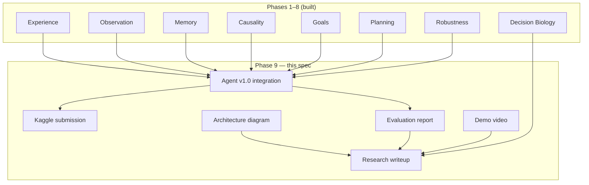
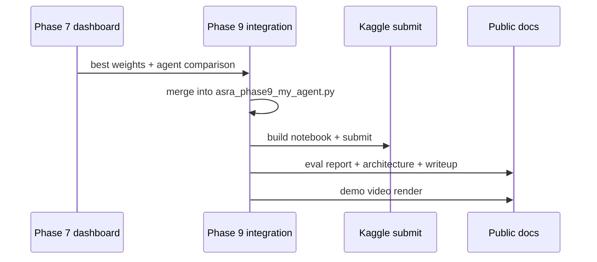

# Phase 9 — Final Submission and Research Story

**Track:** Phase 9 (core ASRA roadmap)  
**Source roadmap:** `private/documents/ASRA-theory/ASRA-roadmap-datasets.md`, `ASRA-detailed-roadmap.md`  
**Timeline:** November 2026  
**Status:** **SPEC COMPLETE** — integration + deliverables planned (`kaggle-notebooks/phase9/`)  
**Author:** Ilakkuvaselvi (Ilak) Manoharan  
**Last updated:** June 2026  
**Depends on:** Phases 1–8 ✅

---

## 1. Mission

Phases 1–8 built, planned, hardened, and extended ASRA across games and biology. Phase 9 answers the presentation question:

> *How do we submit the best ARC agent, document the full architecture, and tell a coherent research story that spans interactive reasoning and Decision Biology?*

Phase 9 is **integration and narrative** — not a new cognitive layer. It packages the cumulative stack into **final competition deliverables**, **evaluation artifacts**, and **public-facing documentation** suitable for ARC Prize 2026, GitHub, and the Nature Foundation Models research program.

```text
Phase 1–8:  build + validate cognitive stack + biology bridge
Phase 9:    select agent, submit, diagram, report, demo, writeup
```

**Primary goal:** deliver **ASRA v1.0** (`asra-v1.0-phase9`) as the **final Kaggle submission** plus a complete **research story** integrating all phases and datasets.

**Agent tag:** `asra-v1.0-phase9`

**Final deliverables (roadmap):**

1. Kaggle submission  
2. GitHub repo (polished)  
3. README  
4. Architecture diagram  
5. Evaluation report  
6. Demo video  
7. Research writeup  
8. Decision Biology extension section  

**Non-goals for Phase 9:**

- New algorithms beyond tuning Phases 6–7
- Large new dataset integrations
- Foundation model training
- Replacing phase-specific specs (they remain source of truth)

---

## 2. Position in ASRA theory

| Phase | Role |
|-------|------|
| 1–5 | Cognitive core: experience → goals |
| 6 | Planning & Milestone #2 |
| 7 | Robustness & final candidate selection |
| 8 | Decision Biology scientific extension |
| 9 | **Integration, submission, communication** |



Phase 9 is the **capstone**: minimal new code, maximum clarity on what was built and why it matters.

---

## 3. Why Phase 9 follows Phase 8

| After Phase 8 only | Phase 9 adds |
|--------------------|--------------|
| Two domain stacks (game + bio) | **Unified narrative** |
| Multiple agent tags (v0.6–v0.9) | **Single v1.0** release |
| Scattered eval reports | **Consolidated evaluation report** |
| Phase notebooks individually | **Final notebook + submit pipeline** |
| Internal specs | **Public README + architecture diagram** |
| Demo notebook only | **Demo video** walkthrough |

**Roadmap rationale:** *"Submit ARC agent and explain ASRA clearly."*

---

## 4. Integrated stack (Phases 1–8)

### 4.1 Cognitive layers in final agent

| Layer | Phase | Library path | Embedded in v1.0 |
|-------|-------|--------------|------------------|
| Experience | 1 | `memory/`, `env/` | ✅ transition logging |
| Observation | 2 | `perception/` | ✅ object hints |
| Memory & exploration | 3 | `exploration/` | ✅ visitation, novelty |
| Causality | 4 | `causality/` | ✅ semantics, uncertainty |
| Goals | 5 | `goals/` | ✅ hypothesis ranking |
| Planning | 6 | `planning/` | ✅ BFS/MCTS, strategies |
| Robustness | 7 | `robustness/` | ✅ stuck, waste, guards |
| Biology bridge | 8 | `decision_biology/` | ✅ metadata + offline demo |

### 4.2 Agent evolution table

| Version | Tag | Layer added |
|---------|-----|-------------|
| Phase 1 | `asra-v0.1` | Experience baseline |
| Phase 3 | `asra-v0.3-phase3` | Exploration memory |
| Phase 4 | `asra-v0.6-phase4` | Causal semantics |
| Phase 5 | `asra-v0.7-phase5` | Goal hypotheses |
| Phase 6 | `asra-v0.8-phase6` | Planning (Milestone #2) |
| Phase 7 | `asra-v0.85-phase7` | Robustness |
| Phase 8 | `asra-v0.9-phase8` | Biology bridge identity |
| **Phase 9** | **`asra-v1.0-phase9`** | **Full integrated stack** |

### 4.3 Final agent scoring (composite)

```text
score(action) = w_exp · exploration_novelty
              + w_sem · semantic_confidence
              + w_goal · goal_alignment(leading_hypothesis)
              + w_plan · plan_step_match
              + w_disc · experiment_discrimination
              - w_waste · action_waste_penalty
              × meta_blend(explore|exploit|balanced)
```

**Reasoning string (v1.0):**

```text
ASRA v1.0: ACTION3 | objects=5 | sem=translate conf=0.81 u=0.12 | goal=move_to_target | strat=reach_target | plan=bfs:2/4 | guard=ok
```

---

## 5. Datasets in final story

Phase 9 does **not** ingest new datasets. It **cites** evidence from each phase:

| Dataset | Phase | Role in final story |
|---------|-------|---------------------|
| ARC-AGI-3 | 1, 4–7, 9 | Primary benchmark; competition score |
| Original ARC | 2, 5 | Abstraction bootstrap; template priors |
| MiniGrid / BabyAI | 3, 6 | Exploration + planning evidence |
| PHYRE / CLEVRER | 4, 5 | Causal + goal reasoning evidence |
| Procgen | 6–7 | Generalization delta |
| Crafter | 6 | Long-horizon strategy |
| DMLab | 7 | Memory stress (optional) |
| LINCS / OmniPath / scPerturb | 8 | Decision Biology extension |
| Cell Painting / HCA | 8 | Morphology + context (demo) |

**Narrative structure:**

```text
1. ARC-AGI-3 — why transition-centric reasoning matters (competition)
2. Original ARC + MiniGrid — how abstraction and memory enable generalization
3. PHYRE + Procgen — causal and robust reasoning evidence
4. LINCS + OmniPath — same architecture, different domain (Decision Biology)
5. Future — foundation models for adaptive scientific reasoning
```

---

## 6. What to build (integration deliverables)

### 6.1 Final Kaggle submission

**Purpose:** Single **production** agent notebook for ARC Prize 2026.

| Artifact | Location |
|----------|----------|
| Agent source | `kaggle-notebooks/phase9/asra_phase9_my_agent.py` |
| Notebook | `kaggle-notebooks/phase9/asra-phase-9-arc-prize-2026.ipynb` |
| Builder | `kaggle-notebooks/phase9/build_phase9_kaggle_notebook.py` |
| Submit script | `kaggle-notebooks/phase9/submit.sh`, `push_and_submit.py` |
| Kernel metadata | `kaggle-notebooks/phase9/kernel-metadata.json` |

**`FinalStackEngine`:** thin integration class composing Phase 4–7 engines with v1.0 weights (tuned from Phase 7 dashboard).

**Self-test requirements:**

```bash
cd kaggle-notebooks/phase9
python3 build_phase9_kaggle_notebook.py
python3 asra_phase9_my_agent.py --self-test
# Must pass: perception, exploration, causality, goals, planning, robustness
```

**Submission checklist:**

- [ ] Notebook runs in Kaggle sandbox (no external imports)
- [ ] Validation parquet emitted
- [ ] Agent version string `asra-v1.0-phase9`
- [ ] Reasoning strings under length limit
- [ ] Regression vs `asra-v0.85-phase7` on replay fixtures

---

### 6.2 GitHub repo polish

**Purpose:** Public repo ready for judges, collaborators, and Nature FM audience.

| Item | Action |
|------|--------|
| Root README | Architecture summary + quickstart + phase map |
| `asra-arc/README.md` | CLI reference, data layout |
| Phase specs index | Link `kaggle-notebooks/phase*/phase*-*.md` |
| License / citation | CITATION.cff or bibtex |
| `.gitignore` | Exclude large data; document download scripts |

**No new code required** — documentation and structure pass.

---

### 6.3 Architecture diagram

**Purpose:** Single **visual** explaining Phases 1–8 and data flow.

**Required views:**

1. **Cognitive stack** (vertical layers 1–7)
2. **Data flow** (state → action → next state loop)
3. **Dual domain** (ARC grid + biology perturbation — Phase 8)
4. **Kaggle vs library** (embedded engines vs `asra-arc/src/asra/`)

**Formats:**

- `docs/architecture/asra-architecture-v1.svg` (primary)
- Mermaid source in `docs/architecture/asra-architecture-v1.md`
- Optional: animated replay frame in demo video

**Content source:** Phase specs + `memory-graph/system-architecture.md`

---

### 6.4 Evaluation report

**Purpose:** Consolidated **metrics document** for all phases.

**Structure:**

```markdown
# ASRA Evaluation Report — v1.0

## Executive summary
## ARC-AGI-3 competition results
## Phase-by-phase metrics
  ### Phase 1 — transitions, hash stability
  ### Phase 2 — object extraction, ARC task eval
  ### Phase 3 — exploration efficiency
  ### Phase 4 — semantic accuracy, uncertainty calibration
  ### Phase 5 — goal hypothesis accuracy
  ### Phase 6 — win rate, actions-to-win, planner success
  ### Phase 7 — robustness, generalization delta
  ### Phase 8 — pathway rank, perturbation response
## Agent version comparison (v0.1 → v1.0)
## Limitations and future work
```

**Data sources:**

- `data/analysis/phase*/`
- `data/robustness/dashboard/summary.json`
- Phase 7 `build-eval-dashboard` output
- Kaggle leaderboard screenshot (manual)

**Output:** `docs/evaluation/asra-eval-report-v1.md` + PDF export

---

### 6.5 Demo video

**Purpose:** 3–5 minute walkthrough for judges and deck.

**Storyboard:**

| Segment | Content |
|---------|---------|
| 0:00–0:30 | Problem: adaptive reasoning in unknown environments |
| 0:30–1:30 | Replay viewer: transitions, state graph, semantics |
| 1:30–2:30 | Goal inference + planning on ARC-AGI-3 episode |
| 2:30–3:30 | Robustness dashboard highlights |
| 3:30–4:30 | Decision Biology demo (LINCS graph) |
| 4:30–5:00 | v1.0 agent + repo link |

**Artifacts:** `docs/demo/asra-v1-demo.mp4` (or hosted link)

---

### 6.6 Research writeup

**Purpose:** Long-form article companion to phase theory papers.

**Location:** `kaggle-notebooks/phase9/asra-phase9-final-research-story.md` (theory)  
**Extended:** `docs/research/asra-research-story-v1.md`

**Sections:**

1. Abstract  
2. Introduction — ARC Prize + scientific reasoning  
3. ASRA architecture (Phases 1–7)  
4. Planning and robustness results  
5. Decision Biology bridge (Phase 8)  
6. Related work  
7. Limitations  
8. Conclusion — Nature Foundation Models vision  

---

### 6.7 Decision Biology extension section

**Purpose:** Dedicated chapter in writeup + eval report appendix.

**Content (from Phase 8):**

- Core mapping table (game ↔ biology)  
- LINCS demo results  
- OmniPath pathway prior ablation  
- Schema isomorphism figure  
- Explicit non-claims (demo scale, not clinical)  

**Cross-link:** `phase8-decision-biology-bridge.md`, `decision_biology/` README

---

## 7. End-to-end integration flow



**Integration CLI (planned):**

```bash
cd asra-arc
PYTHONPATH=src python3 -m asra complete-phase9 \
  --agent-source ../kaggle-notebooks/phase9/asra_phase9_my_agent.py \
  --robustness-dir data/robustness \
  --output-dir docs/

# Generates: eval report draft, architecture mermaid, manifest.json
```

---

## 8. Milestones

| Milestone | Deliverable | Acceptance criteria |
|-----------|-------------|---------------------|
| **9A** | Agent v1.0 integration | Self-test pass; all layer flags green |
| **9B** | Kaggle submission live | Notebook runs; validation parquet on board |
| **9C** | Evaluation report | All phase metrics sections populated |
| **9D** | Architecture diagram | SVG + mermaid in repo |
| **9E** | Research writeup + bio section | Publishable draft ≥3000 words |
| **9F** | Demo video + README polish | Video link in README; install works |

---

## 9. Evaluation metrics (final comparison)

### 9.1 Competition (primary)

| Metric | Source |
|--------|--------|
| ARC-AGI-3 score | Kaggle leaderboard |
| Win rate (replay) | Internal batch on logged games |
| Actions to win | Phase 7 dashboard |
| vs v0.85 regression | No metric regression >5% on fixture set |

### 9.2 Documentation completeness

| Metric | Target |
|--------|--------|
| Phase specs linked | 9/9 |
| CLI commands documented | `complete-phase1` through `complete-phase9` |
| Architecture layers labeled | 8 layers + dual domain |
| Eval report phases | 8 sections + summary |

### 9.3 Research story

| Metric | Target |
|--------|--------|
| Theory papers | phase4–9 articles complete |
| Decision Biology demo | Runnable notebook |
| Citation-ready abstract | ≤250 words |

---

## 10. Kaggle / competition integration

**Final package:** `kaggle-notebooks/phase9/`

| File | Role |
|------|------|
| `asra_phase9_my_agent.py` | `FinalStackEngine` — full stack |
| `asra-phase-9-arc-prize-2026.ipynb` | Competition notebook |
| `build_phase9_kaggle_notebook.py` | Regenerate from agent |
| `submit.sh` | One-command submit |
| `push_and_submit.py` | API push + submit |

**Build & submit:**

```bash
cd kaggle-notebooks/phase9
python3 build_phase9_kaggle_notebook.py
python3 asra_phase9_my_agent.py --self-test
./submit.sh   # or: python3 push_and_submit.py
```

**Version manifest (embedded in agent):**

```python
ASRA_VERSION = "asra-v1.0-phase9"
ASRA_PHASES = [1, 2, 3, 4, 5, 6, 7, 8]  # 8 = bridge metadata only in sandbox
```

---

## 11. Risks and mitigations

| Risk | Mitigation |
|------|------------|
| Last-minute Kaggle regression | Freeze v0.85 fallback; tag v1.0 only after self-test |
| Eval report incomplete | Phase 7 dashboard auto-generates majority |
| Scope creep (new features) | Phase 9 = integration only; bugs → patch release |
| Video production delay | Slides + replay viewer as minimum viable demo |
| Biology section overclaim | Phase 8 limitations box verbatim in writeup |

---

## 12. Related documents

| Document | Location |
|----------|----------|
| Phase 8 spec | `kaggle-notebooks/phase8/phase8-decision-biology-bridge.md` |
| Phase 9 article (theory) | [`asra-phase9-final-research-story.md`](asra-phase9-final-research-story.md) |
| Phase 9 implementation | [`phase9-implementation.md`](phase9-implementation.md) |
| Kaggle notebook | [`asra-phase-9-arc-prize-2026.ipynb`](asra-phase-9-arc-prize-2026.ipynb) |
| Roadmap + datasets | `private/documents/ASRA-theory/ASRA-roadmap-datasets.md` |
| Memory graph | `memory-graph/system-architecture.md` |
| All phase specs | `kaggle-notebooks/phase*/phase*-*.md` |

---

*Status: specification complete; Phase 9 executes when Phases 6–8 acceptance criteria are met. Final agent tag: `asra-v1.0-phase9`.*
